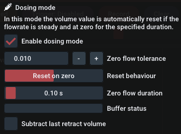

# Erweiterte Verwendung

Dieses Kapitel beschreibt Funktionen, die sich aus speziellen Anwendungsfällen ergeben haben. Wenn Sie eine spezielle Anwendung zur Datenerfassung haben, die zusätzliche Funktionen benötigt, nehmen Sie bitte Kontakt mit uns auf, damit diese in zukünftige Versionen von EasyGraph aufgenommen werden können.

## Dosiermodus {id="dose-mode"}

Der Dosiermodus ist ein spezieller Modus, der über das Menü [Datenprotokollierung](uiguide.md#data-logging) ausgewählt werden kann.

Der Dosiermodus ist für die Volumenmessung von Dosierschüssen gedacht. Der Volumenwert wird automatisch aufgezeichnet und zurückgesetzt, wenn die Durchflussrate für eine bestimmte Dauer konstant bei Null liegt.


Die folgenden Daten werden für jeden Schuss aufgezeichnet:


``` c
* "Schuss-Nr."
* "End-Volumen [ml]" (Gesamt)
* "Max. Δp [bar]"
* "Max. Flowrate [ml/min]"
* "Zeitstempel"
* "Dosiervolumen [+] [ml]"
* "Rückzugsvolumen [-] [ml]"

```

**Demo-Video einer Dosieranwendung mit Punkten**

<video controls autoplay loop src="img/dots.mp4"> </video>  

{align=right}

Um diesen Modus nutzen zu können, müssen die folgenden Anwendungsvoraussetzungen erfüllt sein:

- Hardware = Log.flow (bevorzugt: analoge Version)
- Durchflussmesser angeschlossen an Eingang 1/Mastereingang

Nach Aktivierung des **Dosiermodus** erscheinen zusätzliche Einstellungen:

**Null-Durchfluss-Toleranz**: Beschreibt die absolute Toleranz für den Frequenz-/Durchflusswert, der als "Null-Durchfluss" interpretiert wird

**Rücksetzverhalten**: Wählen Sie das gewünschte Rücksetzverhalten für das Volumen. Die beiden Optionen sind "Zurücksetzen bei Null" und "Zurücksetzen beim ersten Nicht-Null-Wert".

**Dauer des Null-Durchflusses**: Legt die Zeit fest, die der Durchfluss unter der Null-Toleranz liegen muss, um als "Null-Durchfluss" zu gelten und folglich das Volumen zurückzusetzen

**Pufferstatus**: Der Puffer enthält eine Historie von Proben, um zu prüfen, ob der Durchfluss während der gesamten Dauer unter der angegebenen Nulltoleranz liegt. Wenn der Puffer voll ist, können Sie mit der Dosierung beginnen.

**Subtrahieren des letzten Rückzugsvolumens:** Das letzte Rückzugsvolumen wird vom Endvolumen und dem Dosiervolumen abgezogen. Dies kann aktiviert werden, um nur das positive Dosiervolumen zu protokollieren.

!!! Warnung "Dose-Mode Excel-Dateien sind nur für den Export bestimmt"
    Die im **Dosiermodus** exportierten Excel-Dateien können ***nicht*** wieder in EasyGraph importiert werden. Sie müssen alle weiteren Bearbeitungen und Betrachtungen in Excel vornehmen.