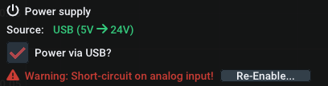
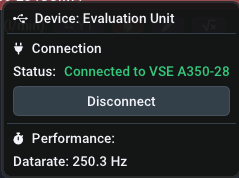
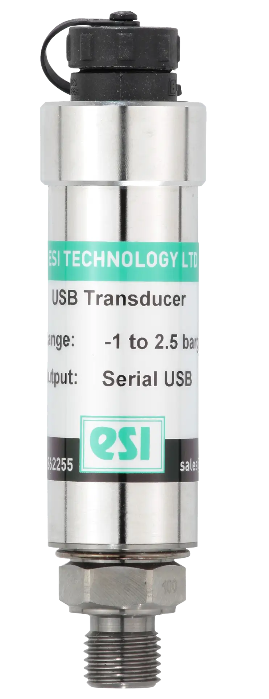
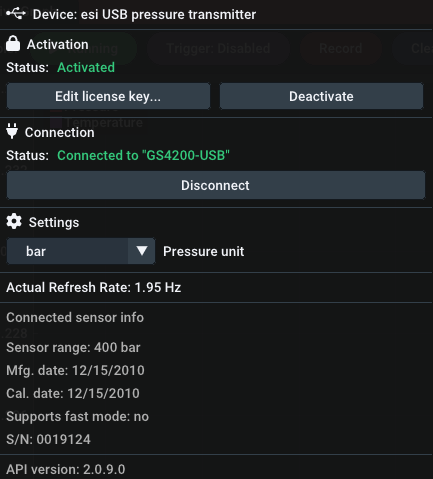

Springen Sie schnell zu dem entsprechenden Abschnitt:

:material-arrow-right: [log.flow](devices.md#logflow-datalogging-system)

:material-arrow-right: [IO.flow®](devices.md#ioflow-with-usb-master)

:material-arrow-right: [Display/FU-Wandler](devices.md#displayfu-wandler-rs232)

:material-arrow-right: [esi-Drucksensor](devices.md#esi-usb-pressure-sensor)

## Log.flow Datenerfassungssystem {id="logflow-datalogging-system"}

### Anschluss

Bevor Sie ein Kabel oder eine Spannung an das log.flow-Gerät anschließen, beachten Sie bitte die folgenden Anschlussdiagramme, um Schäden zu vermeiden. 

Es gibt drei verschiedene Hardware-Versionen von log.flow. Wählen Sie die Registerkarte aus, die dem Typ des log.flow entspricht, über den Sie verfügen:

=== "log.flow (4881)"
    **Verfügbare Kanäle:**

    - Eingang 1: Ein/Zweikanal Quadratur (HTL-Pegel :material-arrow-right: 0..24 V) 
        - Frequenz (:material-arrow-right: Durchflussrate)
        - Impulszahl (:material-arrow-right: Volumen)
    - Eingang 2: Ein/Zweikanal-Quadratur (HTL-Pegel :material-arrow-right: 0..24 V) + [Zusatzfunktionen](devices.md#input-configuration)
        - Frequenz (:material-arrow-right: Durchflussrate)
        - Impulszahl (:material-arrow-right: Volumen)

    !!! info "Info: TTL inkompatibel"
        Leider können TTL-Eingangssignale (0..5 V) **nicht** mit der Standardversion von log.flow gemessen werden. Sie können den Vertrieb um eine angepasste Version mit TTL-Pegel-Unterstützung bitten.

    **Diagramm:**

    {#conndiagramm-logflow}

=== "log.flow V (4881/V)"
    **Verfügbare Kanäle:**

    - Eingang 1: Ein/Zweikanal Quadratur (HTL-Pegel :material-arrow-right: 0..24 V) 
        - Frequenz (:material-arrow-right: Durchflussrate)
        - Impulszahl (:material-arrow-right: Volumen)
    - Eingang 2: Analoger Spannungseingang an Pin 4 (Max. Spannung :material-arrow-right: 0..10 V) 
        - Analoger Wert (:material-arrow-right: Druck, Temperatur,..)

    !!! Gefahr "Vorsicht: 10 V Spannungsgrenze"
        Der Anschluss eines HTL-Durchflussmessers oder einer höheren Spannung als 10 V an den Eingangspin von Eingang 2 kann das Gerät beschädigen!

    **Diagramm:**

    {#conndiagramm-logflowv}

=== "log.flow I (4881/I)"
    **Verfügbare Kanäle:**

    - Eingang 1: Ein/Zweikanal Quadratur (HTL-Pegel :material-arrow-right: 0..24 V) 
        - Frequenz (:material-arrow-right: Durchflussrate)
        - Impulszahl (:material-arrow-right: Volumen)
    - Eingang 2: Analoger Stromeingang an Pin 4 (Max. Strom :material-arrow-right: 20 mA) 
        - Analogwert (:material-arrow-right: Druck, Temperatur,..)

    !!! info "Info: 20 mA Stromgrenze"
        Der Anschluss eines HTL-Durchflussmessers oder einer niederohmigen Quelle an Eingang 2 sollte vermieden werden. _Log.flow I_ wird den Kurzschluss erkennen und den Eingang deaktivieren. Sie können den ausgelösten Kurzschlussschutz im Gerätemenü von EasyGraph wieder aktivieren.
    
    **Diagramm:**

    {#conndiagramm-logflowi}

### Gerätemenü

{align=right}

#### Freischaltung

Wenn Sie sich zum ersten Mal mit Ihrem log.flow-Gerät verbinden, lesen Sie im Kapitel [Aktivierung](gettingstarted.md#logflow-activation) nach, wie Sie den Serienschlüssel einstellen. Die log.flow-Lizenz ist hardwaregebunden an das jeweilige log.flow-Gerät und die zu diesem Gerät passende Seriennummer muss in der EasyGraph-Software eingegeben werden. Der gesamte Vorgang funktioniert auch ohne Internetverbindung.

#### Einstellungen

##### :fontawesome-solid-gear: Konfiguration der Messung

Mit den folgenden Einstellungen können die Messeigenschaften von log.flow angepasst werden. Alle Änderungen der Einstellungen werden sofort wirksam. Um die Einstellungen über mehrere Sitzungen/Verbindungen hinweg beizubehalten, verwenden Sie die Schaltfläche `Save to EEPROM`, um die aktuellen Einstellungen dauerhaft in das log.flow-Gerät zu schreiben.

**:material-timer: Abtastrate**: Standardmäßig wird die Abtastrate dynamisch auf der Grundlage der eingestellten Verlaufszeit des Plots berechnet (Modus: `Automatisch`). Dies stellt sicher, dass Sie bei einer Langzeitaufzeichnung nicht mit einer unglaublich hohen Samplerate aufnehmen. Im Modus `Manuell` können Sie die Abtastrate unabhängig auf einen Wert zwischen 1 Hz und ~1000 Hz (max.) einstellen.

**:material-filter: Filterpegel**: Mit den Schiebereglern für den Filterpegel kann der interne Frequenzfilter des log.flow eingestellt werden. Ein niedriger Filterwert führt zu einer schnelleren und lauteren Frequenzdarstellung - ein höherer Filterwert glättet die Frequenz. Die Anstiegszeiten des Filters können Sie der folgenden Tabelle entnehmen:

Anstiegszeit [ms] | Filtereinstellung
--- | ---
0 | Aus
10 | Dynamisch
100 | Mittel
400 | Glatt [Standard]
2000 | Schwer
5000 | Extrem

**:material-filter: Filtereigenschaften**: Hier muss nichts eingestellt werden. Dieses Mini-Diagramm ist nur ein grober visueller Hinweis darauf, wie der Filter auf eine Rechteckwelle reagiert.

**:material-timer: Frequenzabschaltung**: Die Frequenz-Cutoff-Einstellung legt die Zeit fest, nach der die gemessene Frequenz auf Null gesetzt wird, wenn keine Signalflanken mehr an den Eingangspins gemessen werden. Er ist vergleichbar mit dem Parameter `WAIT TIME` bei unseren Auswertegeräten (A341/A350/FU210). Die Änderung dieses Parameters beeinflusst die minimale Frequenz, die mit log.flow gemessen werden kann. Für den normalen Gebrauch ist die höchste Einstellung `Late (1.8s)` vollkommen ausreichend und erlaubt die Messung von Frequenzen bis zu 0,56 Hz. Wenn Sie eine schnellere Reaktion auf einen Stopp benötigen, können Sie die Cutoff-Zeit herabsetzen, was jedoch zur Folge hat, dass die minimale Frequenz, die gemessen werden kann, höher ist.

Cutoff-Zeit [ms] | Cutoff-Einstellung
--- | ---
250 | Früh
1000 | Normal
1800 | Spät [Voreinstellung]

Die minimale Frequenz $f_{min}$ lässt sich aus der Abschaltzeit $t_{wait}$ mit der folgenden Formel berechnen:

$$
f_{min} = \frac{1}{t_{wait} \textrm{ [in Sekunden]}}
$$

##### :material-power: Stromversorgungskonfiguration  {id="power-supply-configuration"}

Log.flow unterstützt 3 verschiedene Stromversorgungsschemata: 

- Log.flow verfügt über einen internen Spannungsbooster von 5 V auf 24 V, der für die Stromversorgung der Durchflussmessgeräte verwendet werden kann. Wenn die Gesamtstromaufnahme der Durchflussmesser 50 mA überschreitet, sollte ein externes Netzteil verwendet werden, um das log.flow-Gerät nicht zu beschädigen oder zu überhitzen. 
- Eine andere Möglichkeit ist die Verwendung eines T-Verteiler-M12-Steckers an einem der Anschlüsse des Durchflussmessers, um eine bestehende 24-V-Versorgungsspannung von außen (z. B. von der Testbench) einzuspeisen. Die Spannung wird dann an den anderen Durchflussmesser weitergeleitet.
- Externe Stromversorgung über die DC-Buchse und das externe 24-V-Netzteil (im Lieferumfang enthalten) für höhere Stromanforderungen

Sie können den Spannungsbooster über das Kontrollkästchen `Power via USB?` im Gerätemenü aktivieren.

!!! Tipp "Tipp: Spannungsbooster schaltet sich bei Nichtgebrauch ab"
    Wenn Sie das externe Netzteil einstecken, kommt es zu keinem Kurzschluss, da dieser Zustand automatisch erkannt wird. Der Spannungsbooster wird dann automatisch deaktiviert.

=== "log.flow (4881)"

    _keine weiteren Optionen für diesen Gerätetyp_

=== "log.flow V (4881/V)"

    _keine weiteren Optionen zu diesem Gerätetyp_

=== "log.flow I (4881/I)"

    **Kurzschlusserkennung**

    Bei Verwendung von _log.flow I_ überwacht das Gerät kontinuierlich den Strom am Analogeingang. Im Falle eines anhaltenden Kurzschlusses wird der Stromfluss mit Hilfe eines digitalen Schalters gestoppt, und es erscheint ein Meldungsfenster, um den Benutzer auf diesen Zustand hinzuweisen. 
    
    Im Gerätemenü wird der folgende Hinweis angezeigt: 

    

    Sie können den Stromfluss manuell wieder aktivieren, indem Sie die Schaltfläche `Re-Enable...` betätigen. Falls der Kurzschluss immer noch vorhanden ist, wird die Warnung erneut angezeigt. 

##### :material-power-plug: Eingangskonfiguration {id="input-configuration"}

Die verfügbaren Optionen für die Eingangskonfiguration hängen wiederum vom Gerätetyp ab. Wählen Sie die zu Ihrem Gerätetyp passende Registerkarte:

=== "log.flow (4881)"

    **Kanal 1**

    Für den ersten Eingangskanal können Sie zwischen 3 Eingangsoptionen wählen:
    
    - Quadratur (2 Kanäle auf Pin 2+4)
    - Einzelner Kanal (an Pin 2)
    - Einzelner Kanal (auf Pin 4)

    **Kanal 2**

    Kanal 2 der _standard log.flow Version_ erweitert die Funktionen von Kanal 1 um eine zusätzliche externe Volumenrückstellfunktion. Sie können zwischen den folgenden Optionen wählen:

    

    Um diese Funktion zu nutzen, schließen Sie ein digitales 24V-Eingangssignal, einen Schalter/Taster oder etwas Ähnliches an den zweiten Kanal an. Wenn die ausgewählte Bedingung erfüllt ist, wird das Volumen von Kanal 1 zurückgesetzt. 

    Die flankenempfindlichen Einstellungen setzen den Wert bei einem Pinwechsel zurück. Bei Verwendung dieser Option sollten mechanische Schalter mit einem Tiefpassfilter entprellt werden.

    Die pegelempfindlichen Einstellungen halten den Volumenwert auf Null, solange die Bedingung erfüllt ist.

    !!! tip "Tipp: PNP-Eingang"
        Der einfachste Weg, einen externen Schalter anzuschließen, besteht darin, ihn zwischen die 24V-Leitung und den Eingangspin (2 oder 4) zu schalten. Der log.flow-Eingang verhält sich durch den internen Pulldown-Widerstand wie ein PNP-Eingang.

        <Zeichenabschrift>
        { loading=lazy }
        <figcaption>Beispiel für den Anschluss eines Schalters zur externen Rückstellung des Volumens</figcaption>
        </figure>

=== "log.flow V (4881/V)"

    **Kanal 1**

    Für den ersten Eingangskanal können Sie zwischen 3 Eingangsoptionen wählen:
    
    - Quadratur (2 Kanäle auf Pin 2+4)
    - Einzelner Kanal (auf Pin 2)
    - Einzelner Kanal (auf Pin 4)

    **Kanal 2**

    Kanal 2 von _log.flow V_ hat nur die analoge Funktionalität [fest auf Pin 4] (devices.md#conndiagramm-logflowv "Anschlussplan"). Es gibt nichts zur Auswahl.

=== "log.flow I (4881/I)"

    **Kanal 1**

    Für den ersten Eingangskanal können Sie zwischen 3 Eingangsoptionen wählen:
    
    - Quadratur (2 Kanäle auf Pin 2+4)
    - Einkanalig (an Pin 2)
    - Einzelner Kanal (auf Pin 4)

    **Kanal 2**

    Kanal 2 von _log.flow I_ hat nur die analoge Funktionalität [fest auf Pin 4] (devices.md#conndiagramm-logflowi "Anschlussplan"). Es gibt nichts zur Auswahl. 

## IO.flow® mit USB-Master  {id="ioflow-with-usb-master"}

### Anschluss
Der IO-Link USB-Master ist als portables und leichtes Werkzeug zur schnellen Parametrierung und Auswertung von IO-Link im Feld oder zu Demonstrationszwecken konzipiert. 

In Kombination mit dem IO.flow®-Konverter von VSE kann der Master die IO-Link-Prozessdaten an den PC streamen, um die Frequenz- und Impulszahlwerte zu analysieren und aufzuzeichnen. 

Der IO.flow® Konverter unterstützt die folgende Eingangskonfiguration:

**Verfügbare Kanäle:**

- Ein-/Zweikanal Quadratur (HTL-Pegel :material-arrow-right: 0..24 V)
    - Frequenz (:material-arrow-right: Durchflussrate)
    - Impulszahl (:material-arrow-right: Volumen)

**Diagramm:**

<Abbildung markdown>
  { loading=lazy }
  <figcaption>IO.flow Anschlussdiagramm mit USB-Master und Flowmeter</figcaption>
</figure>

Verbinden Sie die M12-Buchse des IO.flow mit dem IO-Link-Master und den M12-Stecker mit dem Durchflussmesser, wie im Anschlussplan dargestellt. Verbinden Sie anschließend den Master über ein Mini-USB-Kabel mit dem PC.

### Gerätemenü

{align=right}

#### Freischaltung

Wenn Sie sich zum ersten Mal mit Ihrem IO-Link-Master verbinden, lesen Sie im Kapitel [Online-Aktivierung](gettingstarted.md#online-activation) nach, wie Sie den Lizenzschlüssel einstellen. Die _Zusatzgeräte-Lizenz_ wird online aktiviert und benötigt bei jedem Programmstart eine funktionierende Internetverbindung.

#### Einstellungen

**:material-timer: Abtastrate**: Die Abtastrate steuert die Aktualisierungszeit des Wertes in der Plotansicht. Eine höhere Aktualisierungsfrequenz führt zu einer dynamischeren Darstellung des Flusses. Sie können sie auf einen Wert zwischen 1 Hz und ~1000 Hz einstellen (was der minimalen unterstützten IO-Link-Auffrischungszeit des Masters entspricht).

!!! info "Hinweis: Samplerate $\neq$ Filter Dynamik"
    Um die Filtercharakteristik des Frequenzplots anzupassen, muss die Filtereinstellung vorab mit dem _IO.flow Configurator_ oder anderen IO-Link-Parametrisierungstechniken eingestellt werden. 

## Anzeige/FU-Wandler RS232 {id="displayfu-wandler-rs232"}

### Anschluss

Da EasyGraph drei verschiedene Auswerteeinheiten unterstützt, wählen Sie den Reiter, der dem angeschlossenen Gerätetyp entspricht:

=== "A341"

    **Verfügbare Kanäle:**

    - Ein-/Zweikanal Quadratur (HTL-Pegel :material-arrow-right: 0..24 V)
        - Frequenz (:material-arrow-right: Durchflussrate)

    **Diagramm:**

    

=== "A350"

    **Verfügbare Kanäle:**

    - Ein/Zweikanal-Quadratur (HTL-Pegel :material-arrow-right: 0..24 V)
        - Wählen Sie zwischen:
            - Frequenz (:material-arrow-right: Durchflussrate)
            - Impulszahl (:material-arrow-right: Volumen)

    **Diagramm:**

    

=== "FU210"

    **Verfügbare Kanäle:**

    - Ein/Zweikanal-Quadratur (HTL-Pegel :material-arrow-right: 0..24 V)
        - Wählen Sie zwischen:
            - Frequenz (:material-arrow-right: Durchflussrate)
            - Impulszahl (:material-arrow-right: Volumen)

    **Diagramm:**

    

### Gerätemenü

{align=right}

#### Freischaltung

Wenn Sie zum ersten Mal eine Verbindung zu Ihrer Auswerteeinheit herstellen, lesen Sie bitte das Kapitel [Online-Aktivierung](gettingstarted.md#online-activation), um zu erfahren, wie Sie den Lizenzschlüssel festlegen. Die _Zusatzgeräte-Lizenz_ wird online aktiviert und benötigt bei jedem Programmstart eine funktionierende Internetverbindung.

#### Verbindungsvorgang

Bei Verwendung eines Display/FU-Konverters ist eine automatische Verbindung nicht möglich, da sie von der verwendeten RS232-Schnittstelle abhängt. Wählen Sie den COM-Port aus, der der Schnittstelle entspricht, die für den Anschluss an die Auswerteeinheit verwendet wird.

!!! Frage "Hilfe: Wie finde ich den richtigen COM-Port?"
    Um den richtigen COM-Port zu finden, an dem Ihre Auswerteeinheit angeschlossen ist, können Sie den in Windows eingebauten **Gerätemanager** (`devmgmt.msc`) verwenden. Öffnen Sie den Gerätemanager über das Startmenü, öffnen Sie die Kategorie "Ports (COM & LPT)" und achten Sie auf Änderungen, während Sie den USB-RS232-Adapter einstecken. Beim Einstecken des Adapters sollte ein neuer COM-Port erscheinen. Dies ist der Port, den Sie in EasyGraph auswählen (in diesem Fall: **COM42**). Wenn der PC mit einem nativen RS232-Anschluss ausgestattet ist, lautet der Anschlussname normalerweise **COM1**.

    

Einige Geräte zeigen anstelle der grünen Schaltfläche [**:material-play: Running**] eine gelbe Meldung "Warten auf Abkühlung" an. Dies ist eine feste Zeitspanne, die das Gerät nach dem Aufbau einer Verbindung benötigt, bevor es mit dem Senden der Live-Werte beginnt. Dies kann leider nicht geändert werden. Nach dem Abwarten der Abkühlzeit sollten die Werte angezeigt werden und die Darstellung ist aktiv.

#### Geschwindigkeit

**:material-timer: Datenrate**: Für Auswertungseinheiten ist die Datenrate fest vorgegeben und wird auf die höchstmögliche Einstellung gesetzt. 

Es gibt keine weiteren Einstellungen zu konfigurieren. Um die Parametrierung zu ändern, müssen Sie die Verbindung zu EasyGraph trennen und den [EasyLoader oder OS10.0] verwenden (https://www.vse-flow.com/downloads.html "vse-flow.com/downloads").

## esi USB-Drucksensor {id="esi-usb-pressure-sensor"}

{ align=right width=20%}

EasyGraph unterstützt auch die Verwendung von esi USB-Drucksensoren. 
Derzeit [v2.0.5] werden die folgenden Sensoren unterstützt:

- esi [GS4200-USB](https://esi-tec.com/product/gs4200-usb/) (langsame Datenübertragung)
- Abtastrate: bis zu ~2 Hz

Die Unterstützung des viel schnelleren [GD4200-USB](https://esi-tec.com/product/gd4200-usb/) (~1000 Hz) ist für zukünftige Versionen geplant.

### GS4200 Spezifikationen

{ align=right width=20%}

"Der digitale Druckmessumformer GS4200-USB von ESI Technology wurde entwickelt, um Druck direkt auf einem Computer zu messen, zu analysieren und aufzuzeichnen, ohne dass kostspielige E/A-Schnittstellenkarten erforderlich sind"[^1]

"Der GS4200-USB wird über den USB-Anschluss des Computers mit Strom versorgt (2 Meter Kabel im Lieferumfang enthalten) und die Daten werden über die mitgelieferte Windows-Schnittstellensoftware auf dem PC dargestellt [...]. Der Sensor hat auch einen eingebauten Temperatursensor, der gleichzeitig mit der Druckmessung angezeigt werden kann. Es können Ober- und Unterdruckgrenzwerte eingestellt und Markierungen auf dem Live-Druckmessdiagramm angebracht werden, um wichtige Druckänderungen anzuzeigen. Die Abtastrate ist wählbar von 0,2 Sekunden bis zu 600 Sekunden mit insgesamt elf Optionen, außerdem gibt es neun Optionen für die Druckeinheit, darunter bar, psi, mbar und MPa sowie Überdruck oder absolute Referenz."[^1]

"Die Druckbereiche beginnen bei -1 bis 2,5 bar und reichen bis zu 0 bis 4000 bar, wobei insgesamt sieben Standarddruckbereiche verfügbar sind und kundenspezifische Bereiche auf Anfrage erhältlich sind."[^1]

[^1]: Quelle: [https://esi-tec.com/product/gs4200-usb/](https://esi-tec.com/product/gs4200-usb/)

### Anschluss

**Verfügbare Kanäle:**

- Druck (Bereich abhängig vom Sensortyp, Einheit wählbar)
- Temperatur (in _°C_)

Schließen Sie den Sensor über das mitgelieferte Mini-USB-Kabel an den PC an.

### Gerätemenü

{align=right}

#### Freischaltung

Wenn Sie den Drucksensor zum ersten Mal anschließen, lesen Sie im Kapitel [Online-Aktivierung](gettingstarted.md#online-activation) nach, wie Sie den Lizenzschlüssel festlegen. Die _Zusatzgeräte-Lizenz_ wird online aktiviert und benötigt bei jedem Programmstart eine funktionierende Internetverbindung.

#### Einstellungen

**:material-ruler: Druckeinheit**: Sie können zwischen den folgenden Optionen wählen:

Einheiten |
--- | 
bar | 
mbar | 
psi | 
MPa |
Pa | 
mm H²O | 
mm Hg | 
atm | 
km cm² | 
kPa | 

Zusätzlich werden Informationen über den angeschlossenen Sensor angezeigt, z.B. Seriennummer, Sensorbereich und das letzte Kalibrierungsdatum.