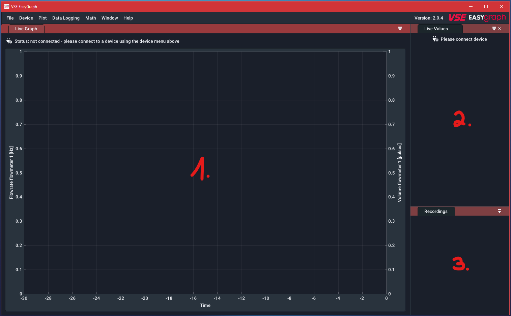
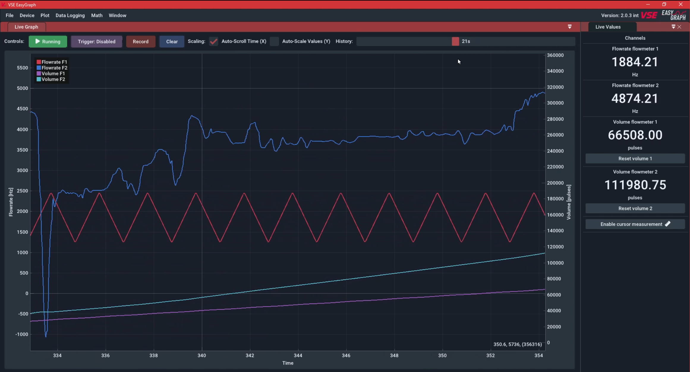
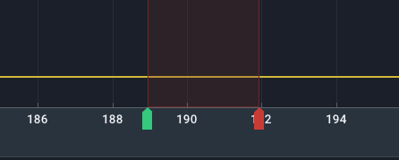

<!-- for setup/activation instructions and connecting the hardware correctly -->

# Erste Schritte

## Überblick 

Beim ersten Start der Software sehen Sie den folgenden Bildschirm:

1. **Live-Grafik-Panel**: Dieses Feld zeigt entweder die von einem angeschlossenen Gerät gestreamten Messwerte oder die Messwerte einer zuvor aufgezeichneten Datei an. Die X-Achse zeigt die Zeit an, seit der der Wert gemessen wurde. Der Wert ganz rechts entspricht dem aktuellen Wert. Die Darstellung unterstützt mehrere Kanäle, die in verschiedenen Farben angezeigt werden. Es gibt zwei Y-Achsen (links/rechts) zur Trennung der Durchfluss- und Volumenwerte auf einer eigenen Achse. 
2. **Live-Wert-Panel**: Dieses Feld zeigt die aktuellen Werte als Text/Zahl an.
3. **Aufzeichnungsfeld**: In diesem Bereich werden alle laufenden und abgeschlossenen Aufzeichnungen aufgelistet. Sie können sie von hier aus öffnen (_Doppelklick_) und verwalten (_Rechtsklick_). Es ist normalerweise ausgeblendet, wenn keine Aufnahmen vorhanden sind.

Der erste Schritt nach dem Öffnen der Software ist in der Regel das Verbinden mit einem externen Datenerfassungsgerät. Öffnen Sie dazu das Menü `Gerät` in der oberen Menüleiste und wählen Sie den Gerätetyp aus, den Sie anschließen möchten. Wenn Sie diese Software zum ersten Mal verwenden, müssen Sie einen Lizenzschlüssel eingeben. Dies wird im [nächsten Kapitel](gettingstarted.md#software-activation "Software Activation") erklärt.

!!! Frage "Hilfe: Panel ist nicht sichtbar"
    Sie können Panels immer wieder sichtbar machen, indem Sie das Menü `Fenster` in der oberen Menüleiste verwenden und das Fenster, das Sie wieder aktivieren möchten, ankreuzen.

## Software-Aktivierung  {id="software-activation"}

Das Aktivierungsverfahren hängt von dem Gerät ab, mit dem Sie die EasyGraph-Software erworben haben:

- Wenn Sie die Software mit einem log.flow-Datenlogger verwenden, ist die Lizenz hardwaregebunden an das jeweilige log.flow-Gerät und die zu diesem Gerät passende Seriennummer muss eingegeben werden. Der gesamte Vorgang funktioniert ohne Internetverbindung.

- Wenn Sie die Software mit einer anderen Hardware (z.B. IO.flow®, Auswerteeinheiten wie A341, A350 oder FU210, esi USB-Drucksensoren) verwenden, muss eine Online-Lizenzaktivierung durchgeführt werden, um die Software nutzen zu können. 

### Log.flow-Aktivierung {id="logflow-activation"}

Das folgende Video zeigt, wie Sie den Seriennummernschlüssel eingeben, um die Software zu aktivieren. Es können mehrere Seriennummernschlüssel für verschiedene log.flow-Geräte gespeichert und verwaltet werden. Die Bindestriche (:material-arrow-right: **-** ) im Serienschlüssel müssen nicht eingegeben werden.

<video controls="" src="img/logflowsetkey.mp4"> </video>  

Vergessen Sie nicht zu überprüfen, ob hinter dem eingegebenen Schlüssel ein Häkchen vorhanden ist. Wenn Sie mit der linken Maustaste auf den Schlüssel klicken, wird dieser als Hauptschlüssel markiert, der bei der Verbindung mit dem Gerät verwendet wird. 

### Online-Aktivierung {id="online-activation"}

!!! info "Hinweis: Nur online"
    Bei jedem Softwarestart benötigt die Software eine Internetverbindung, um die Gültigkeit des Lizenzschlüssels zu überprüfen.

**Unterstützte Geräte:** IO.flow® mit USB-Master, A341, A350, FU210, ESI-USB

Nach dem Kauf erhalten Sie eine E-Mail mit dem Lizenzschlüssel. Nachdem Sie diesen Schlüssel in die Software eingegeben haben (siehe Video unten), können Sie sich mit allen unterstützten Gerätetypen verbinden.

<video controls="" src="img/additionallickey.mp4"> </video>  

Über das Gerätemenü in der oberen Leiste können Sie den Lizenzschlüssel auch bearbeiten oder vom Computer entfernen. Dies kann erforderlich sein, wenn Sie das Aktivierungslimit überschritten haben und es auf einem anderen PC aktivieren möchten. 

## Die erste Aufnahme

<!-- ganz allgemein geräteunabhängig -->
### Herstellen einer Verbindung

Um eine Geräteverbindung herzustellen, vergewissern Sie sich, dass das Gerät richtig mit dem Computer verbunden und eingeschaltet ist. Hilfe dazu finden Sie in der [gerätespezifischen Verbindungsanleitung](devices.md). 

<Figur markdown>
  { loading=lazy }
  <figcaption>Klicken Sie auf die Schaltfläche "Verbinden", um den Verbindungsvorgang zu starten</figcaption>
</figure>

Öffnen Sie das Menü "Gerät" in der oberen Menüleiste und wählen Sie das Gerät aus, mit dem Sie eine Verbindung herstellen möchten. Mit der Schaltfläche "Verbinden" starten Sie den Verbindungsvorgang, der vollautomatisch ablaufen sollte (außer bei der Option "Display/FU", wo ein COM-Port ausgewählt werden muss). Wenn diese Schaltfläche nicht verfügbar ist, haben Sie möglicherweise keinen Lizenzschlüssel eingegeben, wie im [vorherigen Kapitel](gettingstarted.md#software-activation) beschrieben. 

<Abbildung markdown>
  { loading=lazy }
  <figcaption>EasyGraph-Fenster, wenn ein Gerät angeschlossen ist</figcaption>
</figure>

Wenn die Verbindung hergestellt ist, reagiert die Benutzeroberfläche auf das angeschlossene Gerät, indem sie die Kontrollleiste oberhalb des Plot-Panels anzeigt. Eine aktive Geräteverbindung wird durch die grüne Schaltfläche [**:material-play: Running** ] angezeigt. Die aktuell gemessenen Werte werden im **Live-Wert-Panel** und im **Live-Graph-Panel** angezeigt. 

!!! Frage "Hilfe: Ich sehe nur Nullwerte"
    Vergewissern Sie sich, dass Sie Ihre Sensoren mit 24V versorgt haben und dass sie die richtigen Signalpegel (HTL) ausgeben. Wenn Sie log.flow verwenden, lesen Sie [diesen Abschnitt](devices.md#power-supply-configuration), um weitere Informationen über die Stromversorgung Ihrer Sensoren zu erhalten.

### Plot-Navigation

Benutzen Sie Ihre Maus, um im Diagrammfenster zu navigieren. Sehen Sie sich dazu das folgende Video an:

<video controls autoplay loop src="img/ui_easygraph.mp4"> </video>  

### Aufzeichnung 

Das Starten einer Aufnahme ist so einfach wie das Drücken der Aufnahmetaste. 

<video controls autoplay loop src="img/record_btn.mp4"> </video>  

In der Zeitleiste sehen Sie außerdem die Indikatoren "START" und "STOP" sowie einen neuen Eintrag in der Aufzeichnungstafel in der rechten unteren Ecke. 

<figure markdown>
  { loading=lazy }
  <figcaption>Start/Stop-Indikatoren in der Zeitleiste</figcaption>
</figure>

<figure markdown>
  { loading=lazy }
  <figcaption>Aufzeichnungseintrag nach Beendigung der Aufzeichnung</figcaption>
</figure>

Um die aufgezeichneten Daten zu öffnen, _doppelklicken_ Sie auf den Eintrag im Aufzeichnungsfenster. Es erscheint eine neue Registerkarte über dem **Live-Plot-Panel**, die mit `Datei:` und dem Namen der Aufzeichnung beginnt. Sie können in dieser Aufzeichnung auf die gleiche Weise navigieren wie in der Live-Darstellung. 

Es ist wichtig zu beachten, dass die Aufzeichnungen in diesem Zustand noch nicht auf der Festplatte gespeichert sind und im temporären RAM verbleiben, bis Sie sie in eine Datei exportieren. Um die Datei zu exportieren, entscheiden Sie sich zwischen einem vollständigen Datenexport oder einer PDF-Ausgabe zum Drucken.

- Für einen vollständigen Datenexport (der später wieder importiert werden kann) klicken Sie mit der rechten Maustaste auf den Eintrag in der Liste der Aufzeichnungen und wählen Sie "Speichern unter...".

- Für einen PDF-Bericht klicken Sie _mit der rechten Maustaste_ auf den Eintrag in der Liste der Aufzeichnungen und wählen Sie "PDF exportieren".

Nach erfolgreichem Export verwandelt sich das :material-content-save: Symbol in ein :octicons-check-16: Symbol.