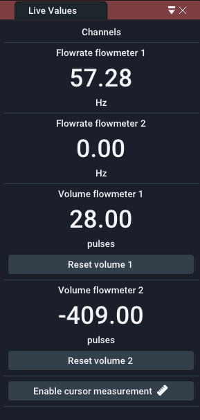
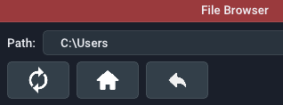
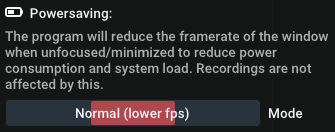

## Bedienfelder

Die Benutzeroberfläche der Software basiert auf Panels in einem Hauptfenster. Standardmäßig besteht das Hauptfenster aus dem großen [**Live-Graph-Panel**](uiguide.md#live-graph-panel) und einem [**Live-Wert-Panel**](uiguide.md#live-value-panel) auf der rechten Seite, aber zusätzliche Fenster können über das [Fenster-Menü](uiguide.md#window) umgeschaltet werden. Sie können die Panels aus dem Fenster ziehen, indem Sie auf die Titelleiste jedes Panels ziehen und sie loslassen. Um sie wieder anzudocken, halten Sie beim Ziehen die Taste `SHIFT` gedrückt und verwenden Sie das Overlay, um es zu positionieren. 

Zuvor gespeicherte Aufnahmen werden als Registerkarten des [**Live-Graph-Panels**](uiguide.md#live-graph-panel) geöffnet. Sie erkennen sie an dem Präfix `Datei:` in der Titelleiste.

### Live-Grafik-Panel  {id="live-graph-panel"}

#### Plot-Navigation

Das Plot-Fenster zeigt einen XY-Plot der Messdaten. Während sich die X-Achse auf die Zeit bezieht, bezieht sich die Y-Achse auf den aktuellen Wert. Auf der linken und rechten Seite des Diagramms können sich zwei separate Y-Achsen befinden. Dies geschieht, um die verschiedenen Dimensionen der Durchflussrate und des Volumens separat zu kontrollieren. 

!!! info inline end "Hinweis: Dies gilt sowohl für die Live-Darstellung als auch für den Dateibetrachter"

Benutzen Sie Ihre Maus, um im Plotfenster zu navigieren:

- Durch Klicken und Ziehen mit der linken Maustaste auf den Plot wird dieser verschoben. 
- Klicken und Ziehen mit der linken Maustaste auf eine Achse verschiebt nur diese Achse
- Ein Doppelklick mit der linken Maustaste auf eine Achse passt diese automatisch an und stellt auch die Funktion [Auto-Scroll oder AutoScale](uiguide.md#controls) wieder her.
- Klicken und Ziehen mit der rechten Maustaste wählt einen Bereich aus, in den gezoomt werden soll
- Scrollen auf einer Achse oder dem Plot zoomt ein/aus

Sehen Sie sich das folgende Video an:

<video controls autoplay loop src="img/ui_easygraph.mp4"> </video> 

#### Steuerelemente  {id="controls"}

- **Start/Pause-Taste:** Startet oder pausiert den eingehenden Datenstrom. Alle Samples während einer Pause werden verworfen. Alternativ können Sie die Auto-Scroll-Funktion deaktivieren (siehe unten), um die Darstellung visuell anzuhalten, während der Datenstrom weiterläuft.

- **Trigger-Schaltfläche:** Aktiviert oder deaktiviert die Trigger-Funktion, die über das [data logging menu](uiguide.md#data-logging) konfiguriert werden kann. Damit wird automatisch eine Aufzeichnung gestartet, wenn eine bestimmte Bedingung erfüllt ist.

- **Aufzeichnungsschaltfläche:** Manuelles Starten oder Stoppen einer Aufzeichnung. Aktive/beendete Aufzeichnungen werden im [Aufzeichnungs-Panel](uiguide.md#recordings-panel) angezeigt.

- Schaltfläche **Löschen:** Löscht alle historischen Daten im Live-Diagramm-Panel. Dies hinterlässt ein leeres Diagrammfenster.

- **Auto-Scroll-Funktion:** Die Auto-Scroll-Funktion sorgt dafür, dass die rechte Seite des Diagramms an der aktuellen Zeit hängen bleibt. Das bedeutet, dass der Wert ganz rechts immer der zuletzt aufgezeichnete Wert ist. Infolgedessen wird das Diagramm mit fortschreitender Zeit automatisch gescrollt. In den meisten Fällen sollte diese Einstellung beibehalten werden. Wenn Sie mit der rechten Maustaste zoomen, wird diese Funktion deaktiviert. Wenn Sie auf die X-Achse doppelklicken, wird diese Funktion wieder aktiviert. Bevor Sie das Diagramm in X-Richtung verschieben können, müssen Sie die Funktion deaktivieren.

- **Auto-Scale-Funktion:** Die Auto-Scale-Funktion passt die Y-Achsen automatisch an die sichtbaren Daten im Diagramm an. Sie ist auch abhängig von der gewählten Verlaufszeit. Die Funktion kann manchmal störend sein (bei sehr kleinen Wertänderungen) und Sie sollten in Erwägung ziehen, sie auszuschalten und die erwarteten Y-Bereiche manuell mit dem Scrollrad und durch Ziehen einzustellen.

- **Lock-Min-Funktion:** Die Lock-Min-Funktion sperrt/fixiert den aktuellen Minimalwert (z.B. "0") der Flussachse. Diese Option kann in Kombination mit der Funktion **Auto-Scale** verwendet werden, um den Maximalwert automatisch zu skalieren, während die X-Achse im Blickfeld bleibt, und um nicht automatisch zu stark zu vergrößern. 

- **Schieberegler für die Historie:** Die ausgewählte Zeit auf dem Schieberegler für die Historie legt den sichtbaren Bereich der Darstellung fest. Er bestimmt, wie lange Sie in die Vergangenheit schauen können. Falls Sie log.flow verwenden und die [Abtastrate] (devices.md#measurement-configuration) auf `Automatic` gesetzt haben, wirkt sich die Verlaufszeit auch (umgekehrt proportional) auf die Abtastrate aus.

#### Begrenzungen

Um die RAM-Nutzung der Software moderat und die Leistung hoch zu halten, ist die maximale Anzahl der in der Grafik angezeigten Proben begrenzt. Daher werden die sichtbaren Samples entfernt, wenn sie eine Puffergröße von 524288 Samples überschreiten. Bitte beachten Sie, dass Aufzeichnungen von dieser Begrenzung nicht betroffen sind, da der Speicher dynamisch zugewiesen wird (solange genügend freier Arbeitsspeicher vorhanden ist).

Wenn Sie lange Aufnahmen planen, ist es daher ratsam, die Sample-Rate des angeschlossenen Geräts zu reduzieren.

### Bedienfeld für Aufzeichnungen  {id="recordings-panel"}

{ align=right}

Das Aufnahme-Panel listet alle aktiven, beendeten und importierten Aufnahmen auf. Frische Aufnahmen bleiben nur im temporären Arbeitsspeicher erhalten, und Sie müssen sie [exportieren](uiguide.md#filetypes-importexport), um sie nach dem Beenden des Programms zu behalten. Neben dem Dateinamen werden verschiedene Icons angezeigt, die die verschiedenen Zustände der Datei anzeigen:

- :fontawesome-solid-tape:: Datei wird gerade aufgezeichnet
- :material-content-save:: Die Datei ist ungespeichert und muss gespeichert werden
- :octicons-check-16:: Datei wurde erfolgreich gespeichert.

Um eine Aufnahme zu verwalten, klicken Sie mit der rechten Maustaste auf den Listeneintrag. Es öffnet sich ein Fenster, das alle Metadaten der Datei enthält. Sie können die Felder einfach bearbeiten. Nach der Bearbeitung müssen Sie die Datei erneut speichern, da sie nicht automatisch auf Ihrer Festplatte aktualisiert wird.

!!! info "Hinweis: Schließen Sie die Datei, um den Namen zu bearbeiten"
    Um den Namen einer Datei zu bearbeiten, müssen Sie die Registerkarte der Datei schließen, wenn sie im Live-Plot-Panel geöffnet ist.

#### Dateitypen + Import/Export  {id="filetypes-importexport"}

Es stehen vier verschiedene Import-/Export-Dateitypen zur Verfügung:

Dateityp | Dateierweiterung | Vorteile | Nachteile | Empfohlen
--- | --- | --- | --- | ---
[Protocol Buffer :material-link:](https://protobuf.dev/) | pb.bin | Schnellste, kleine Größe | Nicht portabel für andere Programme | :octicons-check-16:
Excel Sheet | xlsx | Weithin unterstützter Dateityp, Excel-Grafiken | Sehr langsam, Zeilenbegrenzung, hoher RAM-Verbrauch |
XML-Datei | xml | Schnelles, lesbares Format | Sehr umfangreich und große Dateigröße |
PDF-Datei | pdf | Sieht gut aus, kann schnell einen Bericht erstellen | Keine tatsächlichen Daten, nur Bild der Darstellung | :octicons-check-16: 

!!! Warnung "Excel sheet modifications"
    Beim Importieren einer Excel-Tabelle, die zuvor mit EasyGraph exportiert wurde, können benutzerdefinierte Änderungen wie z.B. benutzerdefinierte Diagramme oder fehlende Zeilen dazu führen, dass die Datei nicht richtig geöffnet wird oder das Programm abstürzt.

##### PDF-Bericht

So sieht der exportierte PDF-Bericht aus:

{width=50%}

### Live-Werte-Panel  {id="live-value-panel"}

{ align=right}

Die **Livewerttafel** enthält die aktuellen Werte des Datenloggers. Die Anzahl der sichtbaren Kanäle ist abhängig vom angeschlossenen Gerät (:material-arrow-right: dessen Kanalfähigkeit) und davon, ob der Kanal im [Plot-Menü](uiguide.md#plot) auf ***sichtbar*** gesetzt ist. Die Kanalnamen werden automatisch an das angeschlossene Gerät angepasst. 

Die **Anzahl der sichtbaren Nachkommastellen** kann für Volumen und Durchfluss im [Math menu](uiguide.md#math) separat eingestellt werden. Diese Einstellung hat keinen Einfluss auf die Aufzeichnungsauflösung oder den internen Wert. In diesem Menü können Sie auch die **Einheitenbezeichnung** ändern, die unter dem Wert angezeigt wird. Um den Wert tatsächlich in andere Einheiten umzurechnen, verwenden Sie die mathematischen Optionen (Faktor und Summand). 

Wenn das log.flow-Gerät angeschlossen ist, verfügt die Lautstärkeanzeige über eine Schaltfläche "Lautstärke zurücksetzen", mit der die Lautstärke schnell auf Null zurückgesetzt werden kann.

!!! tip "Mittlerer Mausklick"
    Verstecken/deaktivieren Sie unbenutzte Kanäle schnell, indem Sie mit der mittleren Maustaste darauf klicken. Sie können sie über das [Plot-Menü](uiguide.md#plot) wieder aktivieren. Deaktivierte Kanäle werden aufgezeichnet, auch wenn sie ausgeblendet sind.

#### Cursor-Messung

Die Cursor-Messung kann entweder über die Schaltfläche `Cursor-Messung aktivieren` unterhalb der Live-Werte oder durch Ankreuzen der Option im [Plot-Menü](uiguide.md#plot) aktiviert werden. Nach der Aktivierung ist es sinnvoll, die Funktionen [Auto-Scroll und AutoScale](uiguide.md#controls) oder das Anhalten des Datenstroms über die Schaltfläche [Running/Pause](uiguide.md#controls) zu deaktivieren. Nach der Aktivierung erscheinen bewegliche Cursors im Live-Plot-Fenster. Sie können sie verschieben, indem Sie mit der linken Maustaste klicken und die Linien oder ihre kleinen Rechteckgriffe an den Rändern des Plots ziehen. 

Unterhalb der **Live-Werte** finden Sie die Messwerte zwischen den Cursorlinien. Auch hier können Sie den Kanal, auf dem Sie messen wollen, über das Kombinationsfeld auswählen. Die Zeitwerte sind unabhängig von den Achsen. Die Messung ist in drei Abschnitte gegliedert: 

- Im ersten Abschnitt werden die Zeitwerte an den Cursorn der X-Achse zusammen mit der Differenz (`Delta`) zwischen ihnen angezeigt. 
- Der zweite Abschnitt enthält die Werte der Cursor der Y-Achse, bezogen auf den ausgewählten Kanal. Auch hier wird ihre Differenz angezeigt. 
- Im dritten Bereich wird eine statistische Auswertung aller Messwerte zwischen den X-Achsen-Cursorn angezeigt. Sie können das Maximum (`yMax`), das Minimum (`yMin`) und den Durchschnitt (`yAvg`) aller dazwischen liegenden Werte sehen.

!!! warning "Cursors don't support files atm"
    Im Moment sind Cursor-Messungen in der Dateiansicht nicht verfügbar. Diese Funktion wird in zukünftigen Versionen hinzugefügt werden.

### File browser panel

You can show the **file browser panel** by enabling the option in the main menu bar using `Window` :material-arrow-right: `Show File Browser`. This will display an explorer-like file browser on the left side of the plot window. 

In the topmost layer the file browser will list all attached harddrives and network drives. Additionally commonly used directories such as `Desktop`,  `User` and `Documents` will be shown. 

While directories are always shown, files are only shown if the filetype is compatible with **EasyGraph**. Supported file extensions are: `pb.bin`, ``xlsx` and `xml`. Import files (recordings) by double clicking on them. The program will then scan the file and verify, that it is compatible. If all checks pass, the file will be shown in the [Recordings panel](uiguide.md#recordings-panel).

You can use the buttons at the top to perform certain actions:

- :material-refresh: **Refresh:** Reload the current directory and re-list all files
- :material-undo: **Up:** Go up one directory layer until you reach the topmost layer with all drives and shortcuts

## Main menu bar

This section will go over every option in the main menu bar. 

### File

{align=right}

**:material-folder: Öffnen:** Verwenden Sie den Explorer, um eine Aufnahme auszuwählen, die Sie wieder importieren möchten. Unterstützte Dateitypen sind `pb.bin`, `xlsx` und `xml`.

**:fontawesome-regular-window-maximize: Dateibrowser anzeigen:** Verwenden Sie das integrierte [Dateibrowser-Panel](uiguide.md#file-browser-panel), um Aufnahmen für den Re-Import zu finden. 

**:fontawesome-solid-floppy-disk: Alle ungespeicherten Aufnahmen speichern:** Öffnet ein Explorer-Fenster, um das Verzeichnis auszuwählen, in das Sie alle ungespeicherten Aufnahmen speichern möchten. Es wird ***nicht*** nach vorhandenen Dateien gesucht, daher ist es ratsam, ein leeres Verzeichnis zu wählen.

**:material-download: Nach Updates suchen:** Startet den Update-Checker. Dies erfordert eine funktionierende Internetverbindung. Wenn eine neue Version verfügbar ist, erhalten Sie weitere Informationen über neue Funktionen 
und einen Download-Link. 

**:octicons-x-12: Beenden:** Schließt die Anwendung.

!!! warning "Schließen mit ungespeicherten Aufnahmen"
    Wenn Sie die Anwendung mit ungespeicherten Aufnahmen schließen, wird ein Popup-Fenster angezeigt, das Sie auffordert, die Dateien entweder zu speichern oder zu verwerfen. Sie können das Schließen auch abbrechen und die Dateien selbst manuell speichern. 

    

    - **Schließen:** Alle Aufnahmen verwerfen und das Programm schließen
    - **Abbrechen:** Das Programm nicht schließen, um manuell zu prüfen
    - **Speichern:** Alle nicht gespeicherten Aufnahmen in ein Verzeichnis speichern und danach schließen

#### Aktualisierungsprüfung

Bei jedem Programmstart prüft die Software auf Software-Updates. Updates können neue Funktionen, mehr Geräteunterstützung, Fehlerbehebungen und Stabilitätsverbesserungen enthalten. Wenn ein neues Update verfügbar ist, wird ein Fenster mit Informationen zu den Änderungen und einem Link zur Download-Seite angezeigt. 

Das Update (`msi`-Datei) muss manuell installiert werden. Sie werden zu unserem Download-Portal weitergeleitet, wo Sie Ihre Kundennummer und den Produkt-/Lizenzschlüssel eingeben müssen.

Sie können den Update-Checker auch manuell aufrufen, indem Sie auf die Versionsnummer in der oberen rechten Ecke klicken oder das [File menu](uiguide.md#file) verwenden.

### Gerät

Das Gerätemenü verwaltet die Verbindung zu einem Datenerfassungsgerät und dessen Einstellungen. 

Da die Beschreibung sehr geräteabhängig und umfangreich ist, wurde sie in einem eigenen Abschnitt untergebracht. Sehen Sie sich das Kapitel [:material-link: Geräte](devices.md) an!

### Plot

{align=right}

Das Plotmenü enthält Optionen, mit denen Sie das Aussehen des Plotfensters anpassen können:

- Sie können die Farbe jedes Plots ändern, indem Sie auf das farbige Quadrat klicken
- Plots ein-/ausblenden, indem Sie sie markieren/entmarkieren
- Verwenden Sie den Schieberegler, um die Linienstärke aller Diagramme zu ändern.
- Markierungen für jeden empfangenen Datenpunkt vom Datenlogger anzeigen

Von hier aus können Sie auch die Funktion "Cursor Measure" aktivieren. Dies wird in [diesem Abschnitt] (uiguide.md#cursor-measurement) ausführlicher beschrieben.

### Datenprotokollierung  {id="data-logging"}

#### Trigger-Optionen 

{align=right}

Das Menü **Datenprotokollierung** enthält Optionen für die Triggerfunktion. Der Trigger kann eine Aufzeichnung automatisch starten und stoppen, wenn eine oder mehrere vordefinierte Bedingungen erfüllt sind. 

Bevor Sie den Trigger über das entsprechende Kontrollkästchen oder über die Schaltfläche [im Live-Diagramm-Panel](uiguide.md#controls) aktivieren, konfigurieren Sie die unten aufgeführten Trigger-Optionen. Sie können optional einen Benachrichtigungston einschalten, der über die Lautsprecher abgespielt wird, wenn der Trigger die Aufzeichnung startet oder stoppt.

**Trigger-Modus:** Zuerst müssen Sie den Trigger-Modus festlegen. Dieser legt fest, ob die Triggerfunktion nach dem ersten erfolgreichen Trigger deaktiviert wird (`OneShot`) oder für nachfolgende Trigger aktiv bleibt (`Repeating`).

**Aufnahmedauer:** Als nächstes stellen Sie die Aufnahmedauer mit dem Schieberegler ein. Die Gesamtdauer ergibt sich aus der Summe der Aufnahmedauer und der Pre-Trigger-Dauer, die Sie im nächsten Schritt einstellen.

!!! tip "Tipp: Benutzerdefinierte Dauer"
    Sie können eine benutzerdefinierte Dauer in Sekunden einstellen, indem Sie mit der linken Maustaste auf den Schieberegler klicken, während Sie die "STRG"-Taste auf der Tastatur gedrückt halten. So können Sie einen Wert manuell über die Tastatur eingeben. Speichern Sie mit der Taste "Enter". 

**Vor-Trigger-Dauer:** Mit dieser optionalen Funktion können Sie der Aufzeichnung Werte hinzufügen, die vor dem Start des Triggers passiert sind. So können Sie sehen, was im System geschah, bevor die Triggerbedingung eintrat. Nachdem Sie einen Wert ungleich Null eingestellt und den Trigger aktiviert haben, füllt sich der Pre-Trigger-Puffer (= Ringpuffer) mit Samples. Sobald er voll ist, können Sie aufzeichnen!

#### Auslösebedingungen

Der Auslöser wird ausgelöst, wenn eine oder zwei Bedingungen zutreffen. Sie können auswählen, wie diese Bedingungen mathematisch miteinander interagieren:

- **Deaktiviert**: Es wird nur Bedingung 1 verwendet
- **AND**: Auslöser ist wahr, wenn Bedingung 1 und Bedingung 2 beide wahr sind
- **OR**: Auslöser ist wahr, wenn entweder Bedingung 1 oder Bedingung 2 oder beide wahr sind

Die Bedingungen selbst sind einfache Vergleiche, die Sie über Dropdown-Menüs konfigurieren können. Die verfügbaren Optionen sind in der folgenden Tabelle aufgelistet:

| Kanäle | Operatoren | Operatorbeschreibung | Wert |
| --- | --- | --- | --- |
| Durchflussrate 1 | = | gleich | Wert eingeben |
| Durchfluss 2 | != | nicht gleich | |
| Volumen 1 | > | größer als | |
| Volumen 2 | >= | größer oder gleich | |
| | < | kleiner als | |
| | <= | kleiner oder gleich | |

### Mathematik  {id="math"}

{align=right width=40%}

Über das Menü **Mathe und Einheit** können Sie kanalspezifische Einheitenberechnungen einstellen. 

In diesem Menü können Sie auch die Bezeichnung der Einheit ändern, die unter dem Wert angezeigt wird. Um den Wert tatsächlich in andere Einheiten umzurechnen, verwenden Sie die mathematischen Optionen (Faktor und Summand).

Wenn Sie das Menü "Laden" erweitern, können Sie Ihre mathematischen Voreinstellungen speichern und wiederherstellen sowie Berechnungsfunktionen verwenden:

- **Speichern in Voreinstellung...:** Speichern Sie den aktuellen Faktor, Summand und die Einheit in einer Voreinstellung mit einem benutzerdefinierten Namen. Es wird empfohlen, einen Namen zu wählen, der Ihnen hilft, diese Voreinstellung später zu unterscheiden, z. B. den Kanaltyp, den Namen des Durchflussmessers, IPF, die Einheit oder die Prüfstandnummer.

- **Voreinstellung laden...:** Laden Sie eine zuvor gespeicherte Voreinstellung. Ein Linksklick zeigt eine Liste aller Voreinstellungen an. Ein Rechtsklick auf eine bestimmte Voreinstellung in dieser Liste zeigt ein Menü mit einer Option zum dauerhaften Löschen der Voreinstellung. 

- **Berechnen [...] aus [...]:** Mit dieser Schaltfläche kann der Frequenz-/Zählwert in den entsprechenden Durchfluss-/Volumenwert umgerechnet werden, indem einfach der K-Faktor des Durchflussmessers verwendet wird. 

- **Look-up aus der Datenbank...:** Mit dieser Option können Sie einfach den Standard-K-Faktor eines VSE-Durchflussmessers auswählen, wenn Sie den durchschnittlichen/mittleren K-Faktor des spezifischen Geräts nicht kennen. 

Im folgenden Video finden Sie eine visuelle Anleitung:

<video controls="" src="img/mathunitmenu.mp4"> </video>  

Mit den Schiebereglern am unteren Rand können Sie die Anzahl der sichtbaren Dezimalstellen (im [Live-Wert-Panel](uiguide.md#live-value-panel)) separat für Volumen und Durchfluss ändern. Diese Einstellung hat keinen Einfluss auf die Auflösung der Aufzeichnung oder den internen Wert. 

### Fenster  {id="window"}

#### Sichtbarkeit

Über das Fenstermenü können Sie die Sichtbarkeit der folgenden Felder umschalten:

- Live-Wert-Panel (rechts)
- Dateibrowser (links)
- Aufzeichnungsfenster (unten rechts)

#### Powersave-Modus

{align=right}

Der Energiesparmodus wurde implementiert, um die Nutzung von Hardwareressourcen im Leerlauf oder bei Nichtbenutzung zu begrenzen. Wenn das Hauptfenster unscharf wird (z.B. weil ein anderes Programm auf dem PC läuft), kann EasyGraph die Bildwiederholrate drosseln, um Strom zu sparen. Wenn der Energiesparmodus aktiv ist und das Fenster nicht fokussiert ist, wird ein grüner Indikator im oberen Bereich des Live-Grafik-Panels angezeigt. 

Es gibt drei verschiedene Energiesparmodi für den nicht fokussierten Programmzustand. Wenn das Programm fokussiert ist, wird das Rendering immer mit voller Geschwindigkeit ausgeführt. 

{align=right}

- Aus: Rendering immer mit voller Geschwindigkeit (0% Energieeinsparung)
- Normal/Drosseln: Framerate auf _6 fps_ senken (~50% Energieeinsparung) :material-arrow-right: `default`
- Maximal: Rendering stoppen (~95% Energieeinsparung)

!!! success "Bemerkung: Die Aufnahme wird nicht beeinträchtigt, wenn das Rendering gedrosselt oder das Fenster minimiert ist!"

#### Fenster Startposition

{align=right}

Mit dieser Funktion können Sie die Größe und die Startposition des EasyGraph-Hauptfensters speichern, die bei jedem Programmstart eingestellt wird. Um die aktuelle Position und Größe zu speichern, drücken Sie einfach `Speichern`. Um die benutzerdefinierte Startposition zu löschen, drücken Sie die Schaltfläche "Löschen". Ist keine eigene Startposition eingestellt (und somit auch keine Schaltfläche "Löschen" sichtbar), startet EasyGraph mittig auf dem Hauptmonitor mit etwas Abstand zu beiden Seiten.

Sie können die Funktion "Fensterstartposition" z.B. nutzen, um EasyGraph im Vollbildmodus auf einem anderen Monitor zu starten.

Wenn das Fenster nach dem Programmstart nicht sichtbar ist, schließen Sie es über das Symbol in der Taskleiste und halten Sie beim nächsten Programmstart die `Umschalt`-Taste gedrückt. Dadurch wird die Startposition auf die Standardeinstellung zurückgesetzt.

### Hilfe

Im Menü **Hilfe** finden Sie _diese Dokumentation_ und verschiedene Optionen zur Steuerung des Programmstatus, wie z.B.:

- Option zum Zurücksetzen der mathematischen Voreinstellungen
- Option zum Wiederherstellen des Standard-Fensterlayouts