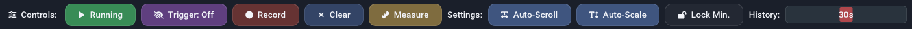
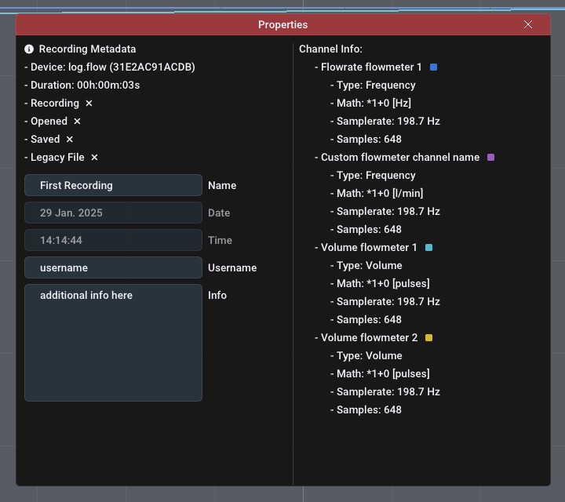
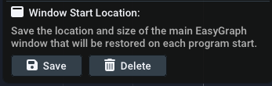

## Fenster {id="panels"}

Die Benutzeroberfläche der Software basiert auf Panels in einem Hauptfenster. Standardmäßig besteht das Hauptfenster aus dem großen [**Live graph panel**](uiguide.md#live-graph-panel) in der Mitte, dem [**device management panel**](#device-management-panel) auf der linken Seite und einem [**Live value panel**](uiguide.md#live-value-panel) auf der rechten Seite, aber zusätzliche Fenster können über das [Settings menu](uiguide.md#settings) umgeschaltet werden. Sie können die Panels aus dem Fenster ziehen, indem Sie auf die Titelleiste jedes Panels ziehen und sie loslassen. Um sie wieder anzudocken, halten Sie beim Ziehen die Taste `SHIFT` gedrückt und verwenden Sie das Overlay, um es zu positionieren. 

Zuvor gespeicherte Aufnahmen werden im [**Aufnahmen-Panel**](uiguide.md#recordings-panel) angezeigt und öffnen sich als Registerkarten des [**Live graph panel**](uiguide.md#live-graph-panel).

### Live-Grafik-Panel  {id="live-graph-panel"}

#### Plot-Navigation

Das Plot-Fenster zeigt einen XY-Plot der Messdaten. Während sich die X-Achse auf die Zeit bezieht, bezieht sich die Y-Achse auf den aktuellen Wert. Auf der linken und rechten Seite des Diagramms können mehrere getrennte Y-Achsen vorhanden sein. Dies ist nützlich, um die verschiedenen Einheiten der Durchflussrate, des Volumens und der Analogwerte separat anzuzeigen.

!!! info inline end "Hinweis: Dies gilt sowohl für die Live-Darstellung als auch für den Dateibetrachter"

Benutzen Sie Ihre Maus, um im Plotfenster zu navigieren:

- Durch Klicken und Ziehen mit der linken Maustaste auf den Plot wird dieser verschoben. 
- Klicken und Ziehen mit der linken Maustaste auf eine Achse verschiebt nur diese Achse
- Ein Doppelklick mit der linken Maustaste auf eine Achse passt diese automatisch an und stellt auch die Funktion [Auto-Scroll oder AutoScale](uiguide.md#controls) wieder her.
- Klicken und Ziehen mit der rechten Maustaste wählt einen Bereich aus, in den gezoomt werden soll
- Scrollen auf einer Achse oder dem Plot zoomt ein/aus

Sehen Sie sich das folgende Video an:

<video controls autoplay loop src="img/ui_easygraph.mp4" style="border-radius: 20px;"> </video> 

#### Steuerelemente  {id="controls"}

- **Start/Pause-Taste:** Startet oder pausiert den eingehenden Datenstrom. Alle Samples während einer Pause werden verworfen. Alternativ können Sie die Auto-Scroll-Funktion deaktivieren (siehe unten), um die Darstellung visuell anzuhalten, während der Datenstrom weiterläuft.

- **Trigger-Schaltfläche:** Aktiviert oder deaktiviert die Trigger-Funktionalität, die über das [Trigger-Menü](uiguide.md#trigger-menu) konfiguriert werden kann, das durch Rechtsklick auf diese Schaltfläche geöffnet wird. Die Triggerfunktion startet automatisch eine Aufzeichnung, wenn eine bestimmte Bedingung erfüllt ist.

- **Aufnahme-Schaltfläche:** Manuelles Starten oder Stoppen einer Aufnahme. Optional können Sie den Dateinamen vor dem Start der Aufnahme per Rechtsklick anpassen. Aktive/beendete Aufnahmen werden im [recordings panel](uiguide.md#recordings-panel) angezeigt.

- **Auto-Scroll-Funktion:** Die Auto-Scroll-Funktion sorgt dafür, dass die rechte Seite des Diagramms an der aktuellen Zeit hängen bleibt. Das bedeutet, dass der Wert ganz rechts immer der zuletzt aufgezeichnete Wert ist. Infolgedessen wird das Diagramm mit fortschreitender Zeit automatisch gescrollt. In den meisten Fällen sollte diese Einstellung beibehalten werden. Wenn Sie mit der rechten Maustaste zoomen, wird diese Funktion deaktiviert. Wenn Sie auf die X-Achse doppelklicken, wird diese Funktion wieder aktiviert. Bevor Sie das Diagramm in X-Richtung verschieben können, müssen Sie die Funktion deaktivieren.

- **Auto-Scale-Funktion:** Die Auto-Scale-Funktion passt die Y-Achsen automatisch an die sichtbaren Daten im Diagramm an. Sie ist auch abhängig von der gewählten Verlaufszeit. Die Funktion kann manchmal störend sein (bei sehr kleinen Wertänderungen) und Sie sollten in Erwägung ziehen, sie auszuschalten und die erwarteten Y-Bereiche manuell mit dem Scrollrad und durch Ziehen einzustellen.

- **Lock-Min-Funktion:** Die Lock-Min-Funktion sperrt/fixiert den aktuellen Minimalwert (z.B. "0") der Flussachse. Diese Option kann in Kombination mit der Funktion **Auto-Scale** verwendet werden, um den Maximalwert automatisch zu skalieren, während die X-Achse im Blickfeld bleibt, und um nicht automatisch zu stark zu vergrößern. Die Funktion ist standardmäßig deaktiviert.

- **Schieberegler für die Historie:** Die ausgewählte Zeit auf dem Schieberegler für die Historie legt den sichtbaren Bereich der Darstellung fest. Er bestimmt, wie lange Sie in die Vergangenheit schauen können. Falls Sie log.flow verwenden und die [Abtastrate] (devices.md#measurement-configuration) auf `Automatic` gesetzt haben, wirkt sich die Verlaufszeit auch (umgekehrt proportional) auf die Abtastrate aus.

#### Begrenzungen

Um die RAM-Nutzung der Software moderat und die Leistung hoch zu halten, ist die maximale Anzahl der in der Grafik angezeigten Proben begrenzt. Daher werden die sichtbaren Samples entfernt, wenn sie eine Puffergröße von 2^19 (524288) Samples überschreiten. Bitte beachten Sie, dass Aufzeichnungen von dieser Begrenzung nicht betroffen sind, da der Speicher dynamisch zugewiesen wird (solange genügend freier Arbeitsspeicher vorhanden ist).

Wenn Sie lange Aufnahmen planen, ist es daher ratsam, die Sample-Rate des angeschlossenen Geräts zu reduzieren.

#### Trigger Menu {id="trigger-menu"}

{align=right}

Das Kontextmenü **Trigger** enthält Optionen für die Triggerfunktionalität. Öffnen Sie es, indem Sie mit der rechten Maustaste auf die Schaltfläche `Trigger` klicken. Der Trigger kann eine Aufnahme automatisch starten und stoppen, wenn eine oder mehrere vordefinierte Bedingungen erfüllt sind. 

Bevor Sie den Trigger über das Kontrollkästchen `Enable Trigger` oder durch Drücken der Schaltfläche `Trigger` [im Live graph panel](uiguide.md#controls) aktivieren, konfigurieren Sie die folgenden Trigger-Optionen. Sie können optional einen Benachrichtigungston einschalten, der über die Lautsprecher abgespielt wird, wenn der Trigger die Aufzeichnung startet oder stoppt (Checkbox `Play sound on trigger`).

**Trigger-Modus:** Zuerst müssen Sie den Trigger-Modus festlegen. Dieser beeinflusst, ob die Triggerfunktionalität nach dem ersten erfolgreichen Trigger deaktiviert wird (`OneShot`) oder für nachfolgende Trigger aktiv bleibt (`Repeating`/`Continuous`).

- **Repeating:** Erneut auslösen, wenn die Bedingung falsch und wieder wahr wird
- **Continuous:** Erneut auslösen, solange die Bedingung wahr ist

**Recording duration:** Als nächstes stellen Sie die Aufzeichnungsdauer mit dem Schieberegler ein. Die Gesamtdauer ist die Summe aus der Aufzeichnungsdauer und der Pre-Trigger-Dauer, die Sie im nächsten Schritt einstellen.

!!! tip "Tipp: Benutzerdefinierte Dauer"
    Sie können eine benutzerdefinierte Dauer in Sekunden einstellen, indem Sie mit der linken Maustaste auf den Schieberegler klicken, während Sie die "STRG"-Taste auf der Tastatur gedrückt halten. So können Sie einen Wert manuell über die Tastatur eingeben. Speichern Sie mit der Taste „Enter“. 

**Vor-Trigger-Dauer:** Mit dieser optionalen Funktion können Sie der Aufzeichnung Werte hinzufügen, die vor dem Start des Triggers passiert sind. So können Sie sehen, was im System geschah, bevor die Triggerbedingung eintrat. Nachdem Sie einen Wert ungleich Null eingestellt und den Trigger aktiviert haben, füllt sich der Pre-Trigger-Puffer (= Ringpuffer) mit Samples. Sobald er voll ist, können Sie aufzeichnen!

**TRIGGER-BEDINGUNGEN**

Der Trigger wird ausgelöst, wenn die konfigurierte Bedingung erfüllt ist. Die Bedingung selbst ist ein einfacher mathematischer Vergleich, den Sie über ein Dropdown-Menü konfigurieren können. Die verfügbaren Optionen sind in der folgenden Tabelle aufgelistet:

| Komparator 1 | Operatoren | Operatorbeschreibung | Komparator 2 |
| --- | --- | --- | --- | 
| Live-Wert | = | gleich | Eingegebener Wert |
 Live-Wert | != | nicht gleich | Eingegebener Wert |
| Live-Wert | > | größer als | Eingegebener Wert |
| Live-Wert | >= | größer oder gleich | Eingegebener Wert |
 Live-Wert | < | kleiner als | Eingegebener Wert |
| Live-Wert | <= | kleiner oder gleich | Eingegebener Wert |

Ändern Sie den Trigger-Komparatorwert, indem Sie Ihren Schwellenwert in das Eingabefeld eingeben. Alternativ können Sie den Auslösewert im Live graph panel anpassen, indem Sie die Linie mit der Aufschrift `Trigger` ziehen. Dazu können Sie den Trigger-Cursor einblenden, ohne den Trigger selbst zu aktivieren, indem Sie die Option „Trigger-Cursor einblenden“ verwenden, um den Wert manuell anzupassen und zu sehen, wo er im Vergleich zu den aktuellen Live-Diagrammdaten steht.

### Device Management Panel

Verwenden Sie das **Geräteverwaltungspanel**, um eine Verbindung zu einem Datenerfassungsgerät herzustellen. Bevor Sie versuchen, eine Verbindung zu einem Gerät herzustellen, vergewissern Sie sich, dass Sie [die erforderlichen Serial Keys hinzugefügt haben](gettingstarted.md#software-activation).

Je nach Gerätetyp kann die Verbindung entweder automatisch oder manuell hergestellt werden:

- Um eine Verbindung zu einem log.flow-Datenlogger oder einem USB-IO-Link-Master für IO.flow® herzustellen, verwenden Sie die Schaltfläche `Auto-Connect`. 
-  Um eine Verbindung zu einer Auswerteeinheit (Display oder FU-Wandler) über einen USB-RS232-Adapter herzustellen, verwenden Sie die Schaltfläche `More` und wählen Sie den passenden COM-Port aus

!!! success "Stellen Sie sicher, dass das Gerät richtig mit dem Computer verbunden und eingeschaltet ist"

| { loading=lazy } | { loading=lazy } |
|---|---|
| `Auto-Connect`-Schaltfläche | `More`-Schaltfläche für manuelle Verbindung |

Wenn die Verbindung hergestellt ist, wird sie zur Geräteliste unter der „Auto-Connect“-Schaltfläche hinzugefügt. Eine aktive Geräteverbindung wird durch den roten Geräteeintrag angezeigt. Die aktuell gemessenen Werte werden im **Live value panel** und im **Live graph panel** angezeigt. 

Sie können mehrere Geräte gleichzeitig hinzufügen, um sie aufzuzeichnen oder gemeinsam in der Live-Darstellung anzuzeigen. Wenn Sie mit der rechten Maustaste auf einen Geräteeintrag klicken, können Sie das gerätespezifische Einstellungsfeld aufrufen, um einige Einstellungen zu ändern oder das Gerät zu trennen/entfernen. Weitere Informationen finden Sie im entsprechenden [Geräteabschnitt dieses Handbuchs](devices.md).

{ loading=lazy }

!!! info "Info: Was sind die grauen Gerätemenüeinträge?"
    Wenn ein grauer Gerätemenüeintrag vorhanden ist, bedeutet dies, dass die Verbindung des Geräts aus irgendeinem Grund unterbrochen wurde (z. B. Abziehen des USB-Kabels). Klicken Sie in diesem Fall mit der rechten Maustaste und entfernen Sie das Gerät aus der Liste.

#### Kanaleinstellungen {id="channel-settings"}

{ loading=lazy }

Unterhalb jedes Gerätes finden Sie alle verfügbaren Datenkanäle. In der Standardeinstellung werden alle Kanäle automatisch zur Live-Darstellung hinzugefügt. Sie können sie durch Anklicken der einzelnen Einträge ein- und ausblenden. Das Pfeilsymbol (:octicons-arrow-right-16:) bedeutet, dass der Kanal dem Live-Plot hinzugefügt wurde, ein Minus-Symbol (:material-minus:) bedeutet, dass er deaktiviert ist. Anstatt zu klicken, können Sie die Kanäle auch per Drag-and-Drop in das Plotfenster ziehen.

Neben dem Kanalnamen finden Sie die folgenden Kanaloptionen: 

- **Darstellungsachse ändern:** Sie können die Y-Achse, auf die sich die Daten beziehen, manuell auswählen. Dies ist nützlich, um Daten mit unterschiedlichen Einheiten (z. B. l/min und Hz) zu trennen.
- **Farbe des Diagramms ändern:** Wählen Sie die Farbe, in der das Diagramm gezeichnet wird. 
- **Kanalbeschreibung bearbeiten:** Ändern Sie den Text und die Einheit des Kanals. Hier ändern Sie nur die **Einheitsbezeichnung**, die unter dem Wert angezeigt wird. Um den Wert tatsächlich in andere Einheiten umzurechnen, verwenden Sie die [math settings](#math-settings) (Faktor und Summand). 
- **Mathe-Einstellungen:** Legen Sie einen benutzerdefinierten Summanden und Faktor fest, um den eingehenden Wert mathematisch zu modifizieren, bevor er gezeichnet/aufgezeichnet wird.

### Mathematik Einstellungen  {id="math-settings"}

{align=right width=40%}

Über das Menü **Mathe und Einheit** können Sie kanalspezifische Einheitenberechnungen einstellen. 

Öffnen Sie das Kontextmenü eines Kanals, um Ihre mathematischen Voreinstellungen zu laden/speichern/wiederherzustellen und Berechnungsfunktionen zu verwenden:

- **Speichern in Voreinstellung...:** Speichern Sie den aktuellen Faktor, Summand und die Einheit in einer Voreinstellung mit einem benutzerdefinierten Namen. Es wird empfohlen, einen Namen zu wählen, der Ihnen hilft, diese Voreinstellung später zu unterscheiden, z. B. den Kanaltyp, den Namen des Durchflussmessers, IPF, die Einheit oder die Prüfstandnummer.

- **Voreinstellung laden...:** Laden Sie eine zuvor gespeicherte Voreinstellung. Ein Linksklick zeigt eine Liste aller Voreinstellungen an. Ein Rechtsklick auf eine bestimmte Voreinstellung in dieser Liste zeigt ein Menü mit einer Option zum dauerhaften Löschen der Voreinstellung. 

- **Berechnen [...] aus [...]:** Mit dieser Schaltfläche kann der Frequenz-/Zählwert in den entsprechenden Durchfluss-/Volumenwert umgerechnet werden, indem einfach der K-Faktor des Durchflussmessers verwendet wird. 

- **Look-up aus der Datenbank...:** Mit dieser Option können Sie einfach den Standard-K-Faktor eines VSE-Durchflussmessers auswählen, wenn Sie den durchschnittlichen/mittleren K-Faktor des spezifischen Geräts nicht kennen. 

### Aufzeichnungsliste  {id="recordings-panel"}

{ align=right}

Das Aufnahme-Panel listet alle aktiven, beendeten und importierten Aufnahmen auf. Frische Aufnahmen bleiben nur im temporären Arbeitsspeicher erhalten, und Sie müssen sie [exportieren](uiguide.md#filetypes-importexport), um sie nach dem Beenden des Programms zu behalten. Neben dem Dateinamen werden verschiedene Icons angezeigt, die die verschiedenen Zustände der Datei anzeigen:

- :fontawesome-solid-tape:: Datei wird gerade aufgezeichnet
- :material-content-save:: Die Datei ist ungespeichert und muss gespeichert werden
- :octicons-check-16:: Datei wurde erfolgreich gespeichert.
- :fontawesome-solid-clock-rotate-left:: Dataset wurde von einem alten Dateityp importiert [pre-v2.2 .bin file]

Um eine Aufzeichnung zu verwalten, klicken Sie mit der rechten Maustaste auf das Listenelement. Sie können die Datei öffnen oder schließen und auch ihr Eigenschaftsfenster öffnen, in dem alle Metadaten dieser Datei angezeigt werden. Sie können die Felder einfach bearbeiten. Nach der Bearbeitung müssen Sie die Datei erneut speichern, da sie nicht automatisch auf Ihrer Festplatte aktualisiert wird.

!!! info "Hint: Datei-Tab schließen, um den Namen zu bearbeiten"
    Um den Namen einer Datei zu bearbeiten, müssen Sie die Registerkarte der Datei schließen, falls sie geöffnet ist.

#### Dateitypen + Import/Export  {id="filetypes-importexport"}

Es stehen vier verschiedene Import-/Export-Dateitypen zur Verfügung:

Dateityp | Dateierweiterung | Vorteile | Nachteile | Empfohlen
--- | --- | --- | --- | ---
[Protocol Buffer :material-link:](https://protobuf.dev/) | pb.bin | Schnellste, kleine Größe | Nicht portabel für andere Programme | :octicons-check-16: 
Excel Sheet | xlsx | Weithin unterstützter Dateityp, Excel-Grafiken | Sehr langsam, Zeilenbegrenzungen, hoher RAM-Bedarf, kein Reimport | |
XML-Datei | xml | Schnelles, lesbares Format | Sehr ausführlich und große Dateigröße | |
PDF-Datei | pdf | Sieht gut aus, schnell zu erstellen | Keine tatsächlichen Daten, nur Bild der Grafik, kein Reimport | :octicons-check-16: 

##### PDF-Bericht

So sieht der exportierte PDF-Bericht aus:

{width=50%}
{width=70%}
{width=70%}

### Live-Werte-Panel  {id="live-value-panel"}

{ align=right}

Das **Live value panel** enthält die aktuellen Werte des Datenerfassungsgeräts. Die Anzahl der sichtbaren Kanäle hängt von den ausgewählten Kanälen im Feld „Geräteverwaltung“ ab. Die dargestellten Kanäle können sich aus mehreren Geräten zusammensetzen. Die Kanalnamen werden automatisch an das angeschlossene Gerät angepasst. 

Sie können die **Anzahl der sichtbaren Dezimalstellen** separat für Volumen und Durchfluss im Menü [Einstellungen] (uiguide.md#settings) ändern. Diese Einstellung hat keinen Einfluss auf die Aufzeichnungsauflösung oder den internen Wert. 

Für alle Kanäle, die eine Lautstärke anzeigen, gibt es in der Wertanzeige eine Schaltfläche „Lautstärke zurücksetzen“, mit der die Lautstärke schnell auf Null zurückgesetzt werden kann.

Wenn Sie einen kleinen Bildschirm haben oder viele Kanäle gleichzeitig aktiv sind, können Sie das Kontrollkästchen `Kompakt` in der oberen rechten Ecke verwenden, um die Werteanzeige zu verkleinern.

!!! tip "Mittlerer Mausklick"
    Verstecken/deaktivieren Sie unbenutzte Kanäle schnell, indem Sie mit der mittleren Maustaste darauf klicken. Sie können sie über das [Gerätemanagement-Fenster](uiguide.md#device-management-panel) wieder aktivieren. Deaktivierte Kanäle werden NICHT aufgezeichnet - nur die im Live-Fenster sichtbaren Plots.

#### Cursor-Messung

Die Cursor-Messung kann entweder über die Schaltfläche `Measure` im Live-Graph oder im Dateigraph-Panel aktiviert werden. Einmal aktiviert, werden die Funktionen [Auto-Scroll und AutoScale](uiguide.md#controls) automatisch deaktiviert. Nach der Aktivierung erscheinen bewegliche Cursors im Live-Diagrammfenster. Sie können sie verschieben, indem Sie mit der linken Maustaste klicken und die Linien oder ihre kleinen Rechteckgriffe an den Rändern des Plots ziehen. 

Unterhalb der **Live-Werte** im rechten Feld finden Sie die Messwerte zwischen den Cursorlinien. Hier können Sie auch den Kanal, auf dem Sie messen möchten, über das Kombinationsfeld auswählen. Die Zeitwerte sind unabhängig von den Achsen. Die Messung ist in drei Bereiche gegliedert:

- Im ersten Abschnitt werden die Zeitwerte an den Cursorn der X-Achse zusammen mit der Differenz (`Delta`) zwischen ihnen angezeigt. 
- Der zweite Abschnitt enthält die Werte der Cursor der Y-Achse, bezogen auf den ausgewählten Kanal. Auch hier wird ihre Differenz angezeigt. 
- Im dritten Bereich wird eine statistische Auswertung aller Messwerte zwischen den X-Achsen-Cursorn angezeigt. Sie können das Maximum, das Minimum, die Differenz und den Durchschnitt aller dazwischen liegenden Werte sehen.

### File browser panel

Sie können das **Dateibrowser-Panel** einblenden, indem Sie in der Hauptmenüleiste die Option `Datei` :material-arrow-right: `Open via File Browser` aktivieren. Dadurch wird ein Explorer-ähnlicher Dateibrowser zum Öffnen von Dateien angezeigt. Mit „Öffnen“ können Sie den Standard-Dateibrowser von Windows verwenden.

In the topmost layer the file browser will list all attached harddrives and network drives. Additionally commonly used directories such as `Desktop`,  `User` and `Documents` will be shown. 

Während Verzeichnisse immer angezeigt werden, werden Dateien nur angezeigt, wenn der Dateityp mit **EasyGraph** kompatibel ist. Unterstützte Dateierweiterungen sind: `bin` und `xml`. Importieren Sie Dateien (Aufzeichnungen) durch einen Doppelklick auf die Datei. Das Programm scannt dann die Datei und prüft, ob sie kompatibel ist. Wenn alle Prüfungen erfolgreich waren, wird die Datei im [Recordings-Panel](uiguide.md#recordings-panel) angezeigt.

Sie können die Schaltflächen oben verwenden, um bestimmte Aktionen durchzuführen:

- :material-refresh: **Auffrischen:** Das aktuelle Verzeichnis neu laden und alle Dateien neu auflisten
- :material-home: **Home:** Zum `Computer` (Heimatverzeichnis) wechseln
- :material-undo: **Aufwärts:** Gehe eine Verzeichnisebene nach oben, bis die oberste Ebene mit allen Laufwerken und Verknüpfungen erreicht ist

## Hauptmenüleiste {id="main-menu-bar"}

In diesem Abschnitt werden alle Optionen der Hauptmenüleiste erläutert. 

### Datei {id="file"}

{align=right}

**:material-folder: Open:** Verwenden Sie den Explorer, um eine Aufnahme auszuwählen, die Sie wieder importieren möchten. Unterstützte Dateitypen sind `bin` und `xml`.

**:material-folder: Open via file browser:** Verwenden Sie den integrierten Dateimanager, um eine Aufzeichnung auszuwählen, die Sie reimportieren möchten. Unterstützte Dateitypen sind „bin“ und „xml“.

**:fontawesome-solid-floppy-disk: Alle ungespeicherten Aufnahmen speichern:** Öffnet ein Explorer-Fenster, um das Verzeichnis auszuwählen, in das Sie alle ungespeicherten Aufnahmen speichern möchten. Es wird ***nicht*** nach vorhandenen Dateien gesucht, daher ist es ratsam, ein leeres Verzeichnis zu wählen.

---

**:octicons-x-16: Close:**: Schließt die geöffnete Dateiplot-Registerkarte.

**:octicons-x-16: Discard:**: Entfernt die geöffnete Datei aus der Aufzeichnungsliste und löscht sie somit. Wenn die Datei bereits gespeichert ist, wird damit nur die Datei aus der Anwendung entfernt (sie wird geschlossen), die eigentliche Datei auf der Festplatte bleibt unberührt.

**:fontawesome-solid-floppy-disk: Save:**: Speichert die Datei als Protobuf-Datei am letzten bekannten Speicherort (oder dem Ort, von dem sie importiert wurde)

**:fontawesome-solid-floppy-disk: Save as...:**: Speichert die Datei als einen wählbaren Dateityp. Siehe [filetypes](uiguide.md#filetypes-importexport) für weitere Informationen.

**:octicons-info-16: Properties**: Zeigt die Metadaten der geöffneten Plotdatei an.

---

**:octicons-x-12: Beenden:** Schließt die Anwendung.

!!! warning "Schließen mit ungespeicherten Aufnahmen"
    Wenn Sie die Anwendung mit ungespeicherten Aufnahmen schließen, wird ein Popup-Fenster angezeigt, das Sie auffordert, die Dateien entweder zu speichern oder zu verwerfen. Sie können das Schließen auch abbrechen und die Dateien selbst manuell speichern. 

    

    - **Schließen:** Alle Aufnahmen verwerfen und das Programm schließen
    - **Abbrechen:** Das Programm nicht schließen, um manuell zu prüfen
    - **Speichern:** Alle nicht gespeicherten Aufnahmen in ein Verzeichnis speichern und danach schließen

### Lizenz {id="license"}

Über das Lizenzmenü können Sie alle Ihre Serienschlüssel verwalten. Verwenden Sie den entsprechenden Menüpunkt, um die jeweiligen Keys zu verwalten.

- log.flow-Schlüssel für [log.flow-Aktivierung](gettingstarted.md#logflow-activation) verwalten
- EasyGraph-Schlüssel für [Online-Aktivierung](gettingstarted.md#online-activation) verwalten

### Einstellungen {id="settings"}

{align=right}

Das Einstellungsmenü enthält Optionen, mit denen Sie das Verhalten der Anwendung ändern und das Aussehen des Plotfensters anpassen können:

**ALLGEMEINE EINSTELLUNGEN**

:octicons-checkbox-16: **Geräteeinstellungen während der Aufzeichnung zulassen**: Während der Aufzeichnung sind die Geräteeinstellungen (Rechtsklick auf den Gerätenamen) normalerweise verboten. Diese Einstellung kann dies außer Kraft setzen.

!!! warning "Not recommended"
    Die Verwendung dieser Einstellung wird nicht empfohlen, da die Geräteparameter während einer aktiven Aufnahme nicht berührt werden sollten. Dies kann auch zu einer ungleichmäßigen Abtastrate führen, da Samples fehlen können, wenn die Parameter zwischen dem PC und dem Gerät synchronisiert werden.

**VISUELLE EINSTELLUNGEN**

:octicons-sliders-16: **Liniendicke:** Ändern Sie die Linienbreite aller Plots, um sie dicker/dünner zu machen

:octicons-sliders-16: **Flowrate dezimals:** Stellen Sie die Anzahl der angezeigten Dezimalstellen im [live value panel](#live-value-panel) für Messungen vom Typ Frequenz ein

:octicons-sliders-16: **Volume decimals:** Stellen Sie die Anzahl der angezeigten Dezimalstellen im [live value panel](#live-value-panel) für Messungen vom Typ Zähler

 ein :octicons-sliders-16: **Analog Decimals:** Einstellen der Anzahl der angezeigten Dezimalstellen im [live value panel](#live-value-panel) für analoge Messungen

:octicons-checkbox-16: **Markierungen für jeden Datenpunkt anzeigen:** Zeigen Sie einen Kreis für jede Probe an, um das tatsächliche Timing der von den Datenloggern empfangenen Datenpunkte zu sehen

!!! info "Hinweis: Nachkommastellen $\neq$ Präzision"
    Die Schieberegler für die Nachkommastellen haben **keinen** Einfluss auf die Aufzeichnungsauflösung oder den internen Wert.

**PANEL-SICHTBARKEIT**

:octicons-checkbox-16: **Live value panel anzeigen:** Zeigt das [live value panel](#live-value-panel) auf der rechten Seite an, das die Live-Werte aller Datenprotokollierungsströme in Textform enthält. Auch die Ergebnisse der Cursor-Messungen werden hier angezeigt.

:octicons-checkbox-16: **Geräte-Manager anzeigen:** Zeigt das [Geräte-Management-Panel](#device-management-panel) auf der linken Seite an, um sich mit Datenlogging-Geräten zu verbinden oder diese zu verwalten.

:octicons-checkbox-16: **Dateibrowser anzeigen:** Zeigt den integrierten Dateibrowser zum Öffnen von Dateien an.

:octicons-checkbox-16: **Aufzeichnungsfenster anzeigen:** Zeigt das Fenster unten links, das alle Aufzeichnungen und importierten Datensätze enthält.

:octicons-checkbox-16: **Leistungsmesswerte anzeigen:** Zeigt die Leistungsmesswerte der Anwendung in der oberen Menüleiste an. Die gemessenen Werte sind Rendering-Leistung (in FPS/Hz), CPU-Last (in %) und RAM-Nutzung (in MB).

**STARTUP BEHAVIOUR**

:octicons-checkbox-16: **Startlogo-Animation überspringen:** Aktivieren Sie diese Option, um die Logo-Animation beim Programmstart nicht anzuzeigen und so einige Sekunden zu sparen.

{align=right}

:octicons-sliders-16: **Standardstartposition des Fensters festlegen:** Mit dieser Funktion können Sie die Größe des EasyGraph-Hauptfensters und die Startposition speichern, die bei jedem Programmstart festgelegt wird. Um die aktuelle Position und Größe zu speichern, drücken Sie einfach `Speichern`. Um die benutzerdefinierte Startposition zu löschen, drücken Sie die Schaltfläche „Löschen“. Ist keine eigene Startposition eingestellt (und somit auch keine Schaltfläche „Löschen“ sichtbar), startet EasyGraph mittig auf dem Hauptmonitor mit etwas Abstand zu beiden Seiten. 

Sie können die Funktion Fensterstartposition verwenden, um EasyGraph beispielsweise im Vollbildmodus auf einem anderen Monitor zu starten.

Diese Funktion ist nicht zu empfehlen, wenn Sie häufig die Monitorkonfiguration wechseln (z.B. beim Andocken Ihres Laptops).

Sollte das Fenster nach dem Programmstart nicht sichtbar sein, schließen Sie es über das Taskleistensymbol und halten Sie beim nächsten Programmstart die „Shift“-Taste gedrückt. Dadurch wird der Startort auf die Standardeinstellung zurückgesetzt.

!!! question "Hilfe! Ich kann das EasyGraph-Fenster nach dem Programmstart nicht mehr sehen!"
    Wenn Sie zuvor die Funktion **Standardstartposition des Fensters festlegen:** verwendet und die Monitorkonfiguration geändert haben, kann es sein, dass das EasyGraph-Hauptfenster außerhalb der Bildschirmgrenzen positioniert ist. Schließen Sie in diesem Fall EasyGraph über die Taskleiste oder den Taskmanager und halten Sie beim nächsten Programmstart die Umschalttaste gedrückt. Dadurch wird die Fensterposition auf die Standardposition für diesen Start gesetzt und Sie können die benutzerdefinierte Fensterstartposition löschen. 

**POWERSAVING**

{align=right}

Der Powersave-Modus wurde implementiert, um den Verbrauch von Hardwareressourcen im Leerlauf oder bei Nichtbenutzung zu begrenzen. Wenn das Hauptfenster unscharf wird (z.B. weil ein anderes Programm auf dem PC läuft), kann EasyGraph die Bildwiederholrate drosseln, um Strom zu sparen. Wenn der Energiesparmodus aktiv ist und das Fenster nicht fokussiert ist, wird im oberen Bereich des Live graph panel eine grüne Anzeige eingeblendet. 

Es gibt drei verschiedene Energiesparmodi für den nicht fokussierten Programmzustand. Wenn das Programm fokussiert ist, wird das Rendering immer mit voller Geschwindigkeit ausgeführt. 

{align=right}

:octicons-sliders-16: **Modus:** Ändert den Grad der Energieeinsparung, den das Programm zu erreichen versucht:

- Aus: Immer mit voller Geschwindigkeit rendern (0% Energieeinsparung)
- Normal/Drosseln: Framerate auf _6 fps_ senken (~50% Energieeinsparung) :material-arrow-right: `default`
- Maximum: Rendering stoppen (~95% Energieeinsparung)

!!! success "Bemerkung: Die Aufnahmeleistung wird nicht beeinträchtigt, wenn sie nicht fokussiert oder minimiert ist!"

### Hilfe {id="help"}

Im Menü **Hilfe** finden Sie hilfreiche Optionen, wie z.B.:

- Öffnen _dieser_ Dokumentation
- Suche nach Software-Updates (:material-earth: Internetzugang erforderlich!)
- Option zum Zurücksetzen der mathematischen Voreinstellungen
- Option zum Wiederherstellen des Standard-Fensterlayouts

### Aktualisierungsprüfung {id="update-check"}

Bei jedem Programmstart sucht die Software nach Software-Updates. Updates können neue Funktionen, mehr Geräteunterstützung, Fehlerbehebungen und Stabilitätsverbesserungen enthalten. Wenn ein neues Update verfügbar ist, wird ein Fenster mit Informationen über die Änderungen und einem Link zur Download-Seite angezeigt. 

Das Update (`msi`-Datei) muss manuell installiert werden. Sie werden zu unserem Download-Portal weitergeleitet, wo Sie Ihre Kundennummer und den Produkt-/Lizenzschlüssel eingeben müssen.

Sie können den Update-Checker auch manuell aufrufen, indem Sie auf die Versionsnummer in der oberen rechten Ecke klicken oder das [Hilfe-Menü](uiguide.md#help) verwenden.
