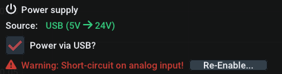

Quickly jump to the relevant section:

:material-arrow-right: [log.flow](devices.md#logflow-datalogging-system)

:material-arrow-right: [IO.flow®](devices.md#ioflow-with-usb-master)

:material-arrow-right: [Display/FU converter](devices.md#displayfu-converter-rs232)

:material-arrow-right: [esi pressure sensor](devices.md#esi-usb-pressure-sensor)

## Log.flow datalogging system

### Connection

Before connecting any cable or voltage to the log.flow device, please refer to the following connection diagrams to avoid damage. 

There are three different hardware versions of log.flow. Select the tab corresponding to the type of log.flow you have on hand:

=== "log.flow (4881)"
    **Available Channels:**

    - Input 1: Single/Dual channel quadrature (HTL-Level :material-arrow-right: 0..24 V) 
        - Frequency (:material-arrow-right: Flowrate)
        - Pulse Count (:material-arrow-right: Volume)
    - Input 2: Single/Dual channel quadrature (HTL-Level :material-arrow-right: 0..24 V) + [additional functions](devices.md#input-configuration)
        - Frequency (:material-arrow-right: Flowrate)
        - Pulse Count (:material-arrow-right: Volume)

    !!! info "Info: TTL incompatible"
        Unfortunately TTL input signals (0..5 V) can **not** be measured with the standard log.flow version. You can ask sales for a custom version with TTL level support.

    **Diagram:**

    {#conndiagramm-logflow}

=== "log.flow V (4881/V)"
    **Available Channels:**

    - Input 1: Single/Dual channel quadrature (HTL-Level :material-arrow-right: 0..24 V) 
        - Frequency (:material-arrow-right: Flowrate)
        - Pulse Count (:material-arrow-right: Volume)
    - Input 2: Analog voltage input on pin 4 (Max. voltage :material-arrow-right: 0..10 V) 
        - Analog Value (:material-arrow-right: Pressure,Temperature,..)

    When connecting a sensor to the analog input, make sure to verify the pinout. You will probably need to build an adapter cable for your specific sensor to match the sensor datasheet's pinout to log.flow's.

    !!! danger "Caution: 10 V voltage limit"
        Connecting a HTL-flowmeter or any voltage higher than 10 V to the input pin of input 2 may damage the device!

    **Diagram:**

    {#conndiagramm-logflowv}

=== "log.flow I (4881/I)"
    **Available Channels:**

    - Input 1: Single/Dual channel quadrature (HTL-Level :material-arrow-right: 0..24 V) 
        - Frequency (:material-arrow-right: Flowrate)
        - Pulse Count (:material-arrow-right: Volume)
    - Input 2: Analog current input on pin 4 (Max. current :material-arrow-right: 20 mA) 
        - Analog Value (:material-arrow-right: Pressure,Temperature,..)

    When connecting a sensor to the analog input, make sure to verify the pinout. You will probably need to build an adapter cable for your specific sensor to match the sensor datasheet's pinout to log.flow's.

    !!! warning "Don't use T-Connector with current input"
        Do not try to connect the analog sensor of an existing machine in parallel to the log.flow I using a T-Connector as this will result in a short circuit. Current sensors need to be connected in series. Internally the current measurement works using a shunt that connects Pin 4 to GND. 

    !!! info "Info: 20 mA current limit"
        Connecting a HTL-flowmeter or any low impedance source to input 2 should be avoided. _Log.flow I_ will detect the short-circuit condition and disable the input. You can re-enable the tripped short-circuit protection within EasyGraph's device menu.
    
    **Diagram:**

    {#conndiagramm-logflowi}

### Device menu

{align=right}

#### Activation

If you are connecting to your log.flow device for the first time, refer to the chapter [Activation](gettingstarted.md#logflow-activation) for instructions how to set the serial key. The log.flow license is hardware-bound to the specific log.flow device and the serial number matching this device needs to be entered into the EasyGraph software. The whole process works without an internet connection.

#### Settings

##### :fontawesome-solid-gear: Measurement configuration

Using the following settings, the measurement characteristics of log.flow can be customized. All changes in settings take effect immediately. To keep the settings between multiple sessions/connections, use the `Save to EEPROM` button to write the current settings permanently to the log.flow device.

**:material-timer: Sample rate**: By default, the sample rate will be calculated dynamically based on the set history time of the plot (Mode: `Automatic`). This makes sure, that you don't record at an incredibly high samplerate during a long-time recording. Using the `Manual` mode, you can set the sample rate indepentently to a value between 1 Hz and ~1000 Hz (max.).

**:material-filter: Filter Level**: Using the sliders for the filter level, the log.flow's internal frequency filter can be adjusted. A lower filter value will yield in a faster and noisier frequency visualization - a higher filter value smoothes out the frequency. Refer to the following table for rise times of the filter:

Rise time [ms] | Filter setting
--- | ---
0 | Off
10 | Dynamic
100 | Medium
400 | Smooth [default]
2000 | Heavy
5000 | Extreme

**:material-filter: Filter Characteristics**: Nothing to set here. This mini-plot is only a rough visual indication how the filter reacts to a square wave input.

**:material-timer: Frequency Cutoff**: The frequency cutoff setting sets the time after which the measured frequency will be set to zero if no signal edges are measured anymore on the input pins. It is comparable with the `WAIT TIME` parameter on our evaluation units (A341/A350/FU210). Changing this parameter influences the minimum frequency, that can be measured with log.flow. For normal usage, the highest setting `Late (1.8s)` is perfectly fine and allows the measurement of frequencies down to 0,56 Hz. If you need a faster response to a stop, you can lower the cutoff time, but as a result the minimum frequency that can be measured will be higher.

Cutoff time [ms] | Cutoff setting
--- | ---
250 | Early
1000 | Normal
1800 | Late [default]

The minimum frequency $f_{min}$ can be calculated from the cutoff time $t_{wait}$ using the following formula:

$$
f_{min} = \frac{1}{t_{wait} \textrm{ [in seconds]}}
$$

##### :material-power: Power supply configuration

Log.flow supports 3 different power supply schemes: 

- Log.flow has an internal 5V to 24V voltage booster, which can be used to power the flowmeters. If the total current draw from the flowmeters exceeds 50 mA, an external power supply should be used to not damage or overheat the log.flow device. 
- Another option is to use a T-junction M12 connector on one of the flowmeter ports to inject a existing 24V supply voltage externally (e.g. from the testbench). The voltage will then be passed through to the other flowmeter.
- External power via the DC Jack and the external 24 V power supply (included) for higher current demands

You can enable the voltage booster using the checkbox `Power via USB?` in the device menu.

!!! tip "Tip: Voltage booster disables itself when not in use"
    If you plug in the external power supply, there will be no short circuit as this state is automatically detected. The voltage booster will be disabled automatically.

=== "log.flow (4881)"

    _no further options on this device type_

=== "log.flow V (4881/V)"

    _no further options on this device type_

=== "log.flow I (4881/I)"

    **Short circuit detection**

    When using _log.flow I_ the device continuously monitors the current into the analog input. In case of a persistent short circuit, the current flow will be stopped using a digital switch and a message box will appear to indicate this condition to the user. 
    
    In the device menu the following notice is shown: 

    

    You can manually re-enable the current flow using the `Re-Enable..` button. In case, the short circuit is still present, the warning will show up again. 

##### :material-power-plug: Input configuration

The available options for the input configuration again depend on the hardware type. Select the tab matching your device type:

=== "log.flow (4881)"

    **Channel 1**

    You can choose between 3 input options for the first input channel:
    
    - Quadrature (2 ch. on Pin 2+4)
    - Single channel (on Pin 2)
    - Single channel (on Pin 4)

    **Channel 2**

    Channel 2 of the _standard log.flow version_ extends the features of channel 1 with an additional external volume reset functionality. You can choose between the following options:

    

    To use this feature, connect a digital 24V input signal, a switch/button or anything similiar to the second channel. If the selected condition is true, the volume of channel 1 will be reset. 

    The edge sensitive settings will reset the value on pin change. Consider debouncing mechanical switches using a low pass filter when using this option.

    The level sensitive settings will keep the volume value at zero as long as the condition is true.

    !!! tip "Tip: PNP input"
        The easiest way of connecting an external switch is to put it between the 24V line and the input pin (2 or 4). The log.flow input acts like a PNP input because of the internal pulldown resistor.

        <figure markdown>
        { loading=lazy }
        <figcaption>Example of switch connection for external volume reset</figcaption>
        </figure>

=== "log.flow V (4881/V)"

    **Channel 1**

    You can choose between 3 input options for the first input channel:
    
    - Quadrature (2 ch. on Pin 2+4)
    - Single channel (on Pin 2)
    - Single channel (on Pin 4)

    **Channel 2**

    Channel 2 of _log.flow V_ only has the analog functionality [fixed on pin 4](devices.md#conndiagramm-logflowv "Connection diagram"). There is nothing to select from.

=== "log.flow I (4881/I)"

    **Channel 1**

    You can choose between 3 input options for the first input channel:
    
    - Quadrature (2 ch. on Pin 2+4)
    - Single channel (on Pin 2)
    - Single channel (on Pin 4)

    **Channel 2**

    Channel 2 of _log.flow I_ only has the analog functionality [fixed on pin 4](devices.md#conndiagramm-logflowi "Connection diagram"). There is nothing to select from. 

## IO.flow® with USB Master

### Connection

The IO-Link USB-Master is designed to be an portable and lightweight tool to quickly parametrize and evaluate IO-Link in the field or for demonstration purposes. 

In combination with VSE's IO.flow® converter the master can stream the IO-Link process data to the pc to analyze and record the frequency and pulse count values. 

The IO.flow® converter supports the following input configuration:

**Available Channels:**

- Single/Dual channel quadrature (HTL-Level :material-arrow-right: 0..24 V)
    - Frequency (:material-arrow-right: Flowrate)
    - Pulse Count (:material-arrow-right: Volume)

**Diagram:**

<figure markdown>
  { loading=lazy }
  <figcaption>IO.flow connection diagram with USB-Master and flowmeter</figcaption>
</figure>

Connect the female M12 side of the IO.flow to the IO-Link master and the male M12 side to the flowmeter as shown in the connection diagram. After this connect the master to the PC using a Mini-USB cable.

### Device menu

{align=right}

#### Activation

If you are connecting to your IO-Link master for the first time, refer to the chapter [Online Activation](gettingstarted.md#online-activation) for instructions how to set the license key. The _additional devices license_ is activated online and needs a working internet connected on every program start.

#### Settings

**:material-timer: Sample rate**: The samplerate controls the refresh time of the value in the plot view. A higher refresh frequency will yield a more dynamic representation of the flow. You can adjust it to a value between 1 Hz and ~1000 Hz (which corresponds to the minimum supported IO-Link refresh time of the master).

!!! info "Hint: Samplerate $\neq$ Filter dynamics"
    To adjust the frequency plot's filter characteristics, the filter setting has to be set in advance using the _IO.flow Configurator_ or other IO-Link parametrization techniques. 

## Display/FU Converter RS232

### Connection

As there are three different evaluation units supported by EasyGraph, select the tab corresponding to the connected device type:

=== "A341"

    **Available Channels:**

    - Single/Dual channel quadrature (HTL-Level :material-arrow-right: 0..24 V)
        - Frequency (:material-arrow-right: Flowrate)

    **Diagram:**

    

=== "A350"

    **Available Channels:**

    - Single/Dual channel quadrature (HTL-Level :material-arrow-right: 0..24 V)
        - Choose between:
            - Frequency (:material-arrow-right: Flowrate)
            - Pulse Count (:material-arrow-right: Volume)

    **Diagram:**

    

=== "FU210"

    **Available Channels:**

    - Single/Dual channel quadrature (HTL-Level :material-arrow-right: 0..24 V)
        - Choose between:
            - Frequency (:material-arrow-right: Flowrate)
            - Pulse Count (:material-arrow-right: Volume)

    **Diagram:**

    

### Device menu

{align=right}

#### Activation

If you are connecting to your evaluation unit for the first time, refer to the chapter [Online Activation](gettingstarted.md#online-activation) for instructions how to set the license key. The _additional devices license_ is activated online and needs a working internet connected on every program start.

#### Connection process

Automatic connection not possible when using a display/FU converter because it depends on the used RS232 interface. Select the COM-Port that corresponds to the interface used for connection to the evalution unit.

!!! question "Help: How to find the right COM-Port?"
    To find the right COM-Port that your evaluation unit is connected to, you can use the Windows build-in **Device Manager** (`devmgmt.msc`). Open the device manager via the start menu, open up the category `Ports (COM & LPT)` and watch for changes as you plug in the USB-RS232 adapter. When plugging the adapter in, a new COM-Port should appear. This is the port that you select in EasyGraph (in this case: **COM42**). If the PC is equipped with a native RS232 port, the port name is usually **COM1**.

    

Some devices will show a yellow `Waiting for cooldown..` message in place of the green [**:material-play: Running** ] button. This is a fixed time that the device needs after initiating a connection before it starts the sending the live values. Unfortunately this cannot be changed. After waiting the cooldown time, the values should start showing up and the plot will be active.

#### Performance

**:material-timer: Data rate**: For evaluation units, the datarate is fixed and will be set to the highest possible setting. 

There are no additional settings to configure. To change the parametrization, you will need to disconnect EasyGraph and use the [EasyLoader or OS10.0](https://www.vse-flow.com/downloads.html "vse-flow.com/downloads").

## esi USB pressure sensor

{ align=right width=20%}

EasyGraph also supports the usage of esi USB pressure sensors. 
Currently [v2.0.5] the following sensors are supported:

- esi [GS4200-USB](https://esi-tec.com/product/gs4200-usb/) (Slow data transfer)
    - Sample rate: up to ~2 Hz

Support for the much faster [GD4200-USB](https://esi-tec.com/product/gd4200-usb/) (~1000 Hz) is planned for future versions.

### GS4200 specifications

{ align=right width=20%}

"The ESI Technology GS4200-USB digital pressure transducer has been designed to measure, analyse and record pressure directly on to a computer without the need for costly I/O interface boards."[^1]

"The GS4200-USB is powered by the computer's USB port (2 meter cable supplied) and the data is presented on the PC via the supplied Windows interface software [...]. The sensor also has a built in temperature sensor and it is possible to display this at the same time as the pressure measurement. High and low pressure limits can be set as well putting markers on the live pressure measurement graph to indicate any important changes in pressure. Sampling rate is selectable from 0.2 seconds up to 600 seconds with a total of eleven options, there is also nine pressure unit options including bar, psi, mbar & MPa as well as gauge or absolute reference."[^1]

"Pressure ranges start from -1 to 2.5 bar all the way up to 0 to 4000 bar with a total of seven standard pressure ranges available and customer specific ranges available on request."[^1]

[^1]: Source: [https://esi-tec.com/product/gs4200-usb/](https://esi-tec.com/product/gs4200-usb/)

### Connection

**Available Channels:**

- Pressure (range depends on sensor type, selectable unit)
- Temperature (in _°C_)

Connect the sensor to the PC using the supplied Mini-USB cable.

### Device menu

{align=right}

#### Activation

If you are connecting to the pressure sensor for the first time, refer to the chapter [Online Activation](gettingstarted.md#online-activation) for instructions how to set the license key. The _additional devices license_ is activated online and needs a working internet connected on every program start.

#### Settings

**:material-ruler: Pressure unit**: You can choose between the following options:

Units |
--- | 
bar | 
mbar | 
psi | 
MPa |
Pa | 
mm H²O | 
mm Hg | 
atm | 
km cm² | 
kPa | 

Additionally, information on the connected sensor is displayed, e.g. serial number, sensor range and the last calibration date.
