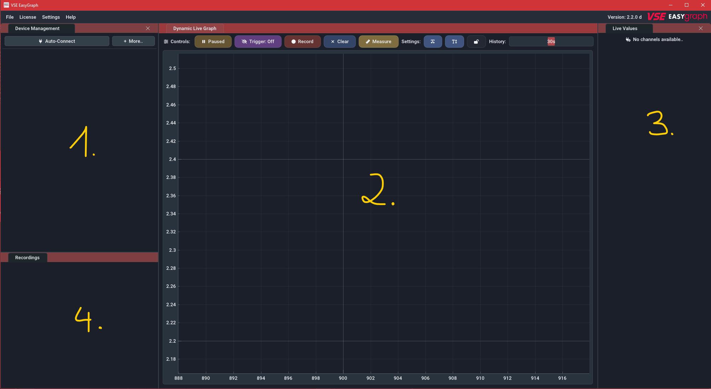
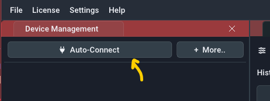
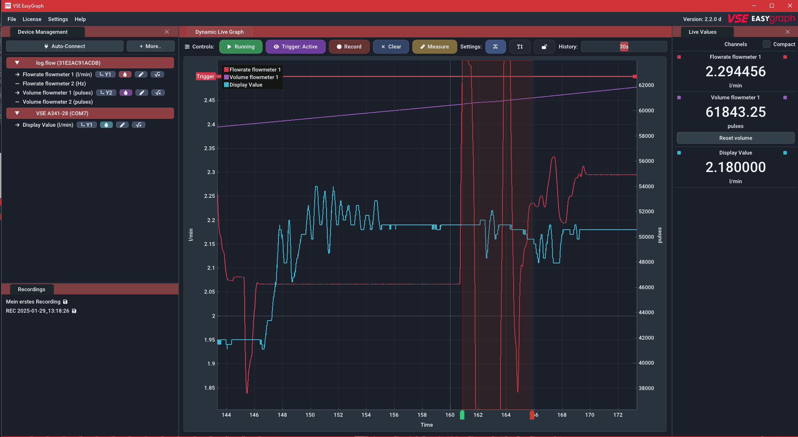
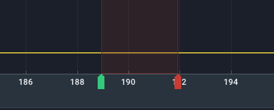

<!-- for setup/activation instructions and connecting the hardware correctly -->

# Getting Started

## Overview 

On the first software start you will be presented with the following screen:

1. **Device management panel**: This panel manages all device connections. Once the license keys are entered, you can use the `Auto-Connect` button to connect to log.flow or IO.flow devices that are attached to the computer. For other device types you can use the `More` button to manually connect via a COM-Port. This panel allows you to modify device parameters and select/edit any channel the device provides.
2. **Live graph panel**: This panel shows either the measured values streaming from the connected devices or the measured values from a previously recorded file. The X-Axis shows the time since the value is measured. When live values are streaming in, the rightmost value corresponds to the current value. The plot supports multiple channels which will be displayed in different colors. There are up to three Y-Axes (left/right) for seperating the flowrate, volume and analog values on their own axis. 
3. **Live value panel**: This panel shows the current values as a text/number.
4. **Recordings panel**: This panel lists all ongoing and finished recordings. You can open (_double-click_) and manage (_right-click_) them from here. It is usually hidden if no recordings are present.

The first step after opening the software is usually connecting to an external datalogging device. In order to do that, use the `Auto-Connect` and `More` buttons in the Device management panel. When first using this software, a suitable license key must be provided. This will be explained in the [next chapter](gettingstarted.md#software-activation "Software Activation").

!!! question "Help: Panel is not visible"
    You can always make panels visible again using the `Settings` menu in the top menu bar and checking the panel that you want to re-enable.

## Software Activation

The activation procedure depends on the on the device you got the EasyGraph software with:

- If you are using the software with a log.flow datalogger, the license is hardware-bound to the specific log.flow device and the serial number matching this device needs to be entered. The whole process works without an internet connection.

<!--
- If you are using the software with a dosing controller datalogger, the license is also hardware-bound to the specific  device and the serial number matching this device needs to be entered. The whole process works without an internet connection.
-->

- If you are using the software with any other hardware (e.g. IO.flow®, Evaluation units like A341, A350 or FU210), an online license activation needs to be performed in order to use the software. 

### Log.flow Activation

The following video shows how to enter the serial number key in order to activate the software. Multiple serial keys for different log.flow devices can be saved and managed. The dashes (:material-arrow-right: **-** ) in the serial key do not need to be entered.

<video controls="" src="img/logflowsetkey.mp4"> </video>  

By right-clicking, you can also add a label to the key to remember which device it belongs to. Alternatively you could for example add your customer id here to find it easily later when you want to [update the software](uiguide.html#update-check).

### Online Activation

!!! info "Hint: Online-only"
    On each software start, the software requires an internet connection at startup to verify the validity of the license key.

**Supported Devices:** IO.flow® with USB-Master, A341, A350, FU210

After purchase you will receive an email with the license key. After entering this key into the software (see video below), you will be able to connect to all supported device types.

<video controls="" src="img/additionallickey.mp4"> </video>  

Using the device menu in the top bar you can also edit or remove the license key from the computer. This could be required if you have exceeded the activation limit and want to activate it on another pc. 

## The first recording

<!-- ganz allgemein geräteunabhängig -->
### Etablishing a connection

In order to establish a device connection, make sure the device is connected properly to the computer and turned on. For help with this refer to the [device specific connection instructions](devices.md). 

<figure markdown>
  { loading=lazy }
  <figcaption>Click on the connect button to start the connection procedure</figcaption>
</figure>

In the **Device management panel** use the `Auto-Connect` button to start the connection process which should be fully automatic (except for the Display/FU option where a COM-Port has to be selected using the `More` button). If a connection can't be established, you may have not entered a license key, as described in the [previous chapter](gettingstarted.md#software-activation). 

<figure markdown>
  { loading=lazy }
  <figcaption>EasyGraph window when a device is connected</figcaption>
</figure>

When the connection is established, it will be added to the device list below the `Auto-Connect` button. An active device connection is indicated by the red device entry. The currently measured values will be shown in the **Live value panel** and the **Live graph panel**. 

!!! question "Help: I only see zero values"
    Make sure you have powered your sensors with 24V and they output the right signal levels (HTL). If you use log.flow, refer to [this section](devices.md#power-supply-configuration) to get more info about powering your sensors.

### Plot navigation

Use your mouse to navigate the plot window. Refer to the following video:

<video controls autoplay loop src="img/ui_easygraph.mp4"> </video>  

### Recording 

Starting a recording is as easy as clicking the `RECORD` button with the left mouse button. If you want to directly specify a custom filename, right-click the `RECORD` button or shift-click it.

<video controls autoplay loop src="img/record_btn.mp4"> </video>  

You will also notice green `START` and red `STOP` indicators in the timeline and a new entry in the recordings panel in the bottom right corner. 

<figure markdown>
  { loading=lazy }
  <figcaption>Start / Stop indicators in plot timeline</figcaption>
</figure>

<figure markdown>
  { loading=lazy }
  <figcaption>Recording entry after stopping the recording</figcaption>
</figure>

To open the recorded data, _double-click_ on the entry in the recordings panel. A new tab will appear on top of the **live plot panel** that starts with `File:` and the name of the recording. You can navigate this recording in the same way as the live plot. 

!!! warning "Recording files do not autosave!"
    It is important to note that in this state recordings are ***not*** saved to disk yet and stay in volatile RAM until you export them to a file. To export the file, decide between a full data export or a PDF output for printing.

- For a full data export (that can be re-imported later) _right-click_ on the entry in the recordings list or under the `File` menu and select `Save as..` :material-arrow-right: `Protobuf-File [.bin]`.

- For a PDF report, _right-click_ on the entry in the recordings list or under the `File` menu and select `Save as..` :material-arrow-right: `Report [.pdf]`.

After a successful export the :material-content-save: icon will turn into a :octicons-check-16: icon.
