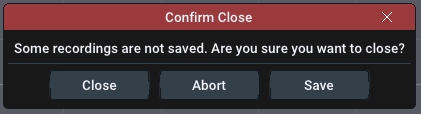
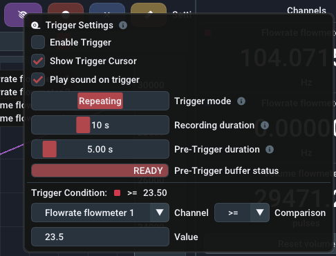

## Panels

The software's user interface is based on panels in a main window. By default, the main window consists of the big [**Live graph panel**](uiguide.md#live-graph-panel) and a [**Live value panel**](uiguide.md#live-value-panel) on the right, but additional windows can be toggled using the [Window menu](uiguide.md#window). You can drag the panels out of the window by dragging on the title bar of each panel and dropping them. To re-dock them, press and hold the `SHIFT` key while dragging and use the overlay to position it. 

Previously saved recordings open up as tabs of the [**Live graph panel**](uiguide.md#live-graph-panel). You can identify them by the `File:` prefix in the title bar.

### Live graph panel

#### Plot navigation

The plot window shows an XY-Plot of the measured data. While the X-Axis refers to the time, the Y-Axis refers to the actual value. There may be multiple seperate Y-Axes on the left and right side of the plot. This is useful to seperately display the different units of flowrate, volume and analog values. 

!!! info inline end "Hint: This applies to both the live plot and the file viewer"

Use your mouse to navigate the plot window:

- Clicking and dragging with the left mouse button on the plot moves it. 
- Clicking and dragging with the left mouse button on an axis moves this axis only
- Double left clicking in an axis auto-adjusts it and also recovers [Auto-Scroll or AutoScale](uiguide.md#controls) functionality.
- Clicking and dragging with the right mouse button selects a region to zoom into
- Scrolling on an axis or the plot zooms in/out

Refer to the following video:

<video controls autoplay loop src="img/ui_easygraph.mp4"> </video> 

#### Controls

- **Running/Pause button:** Start or pause the incoming data stream. All samples during a pause will be discarded. Alternatively you can disable the Auto-Scroll feature (see below) to visually pause the plot while still keeping the data stream running.

- **Trigger button:** Enables or disables the trigger functionality that can be configured using the [trigger menu](uiguide.md#trigger-menu) which can be opened by right-clicking this button. The trigger functionality will start a recording automatically if a certain condition is met.

- **Record button:** Manually start or stop a recording. Optionally use a right-click to customize the filename before starting the recording. Active/finished recordings will be shown in the [recordings panel](uiguide.md#recordings-panel).

- **Clear button:** Clear all historic data in the live graph panel. This leaves you with an empty plot window.

- **Auto-Scroll Feature:** The Auto-Scroll feature will make the right side of the plot sticky with the current time. This means that the most right value will always be the most recently recorded value. As a consequence the plot will automatically scroll as time progresses. In most cases, it should be kept on. When zooming using the right mouse button, this feature will be disabled. When double clicking the X-Axis, this feature will be re-enabled. Before you can move the plot in the X direction, you will need to disable the feature.

- **Auto-Scale Feature:** The Auto-Scale feature will automatically adjust the Y-Axes according to the visible data in the plot. It is also dependent on the selected history time. The feature can sometimes be distracting (for very small value changes) and you should consider turning it off and manually setting the expected Y-Ranges using the scroll wheel and dragging.

- **Lock-Min Feature:** The Lock-Min feature will lock/fix the current minimum value (e.g. `0`) of the flow axis. This option can be used in combination with the **Auto-Scale** feature to allow the maximum value to scale automatically while keeping the X-Axis in view and to not automatically zoom in too much. It is disabled by default. 

- **History slider:** The selected time on the history slider will set the visible range of the plot. It controls how long you can look into the past. In case you use log.flow and have set the [sample rate setting](devices.md#measurement-configuration) to `Automatic`, the history time will also (inversely proportional) affect the sample rate.

#### Limits

To keep the RAM usage of the software moderate and the performance high, the maximum number of samples shown in the plot is limited. Therefore the visible samples will be removed if they exceed a buffer size of 2^19 (524288) samples. Please note that recordings are not affected by this limit as the memory is allocated dynamically (as long as there is enough free RAM).

If you plan to take long recordings, it is therefore advisable to reduce the sample rate of the connected device.

### Recordings panel

{ align=right}

The recordings panel lists all active, finished and imported recordings. Fresh recordings only persist in temporary RAM and you have to [export](uiguide.md#filetypes-importexport) them in order to keep them after the program exits. You will see different icons besides the filename to show different states of the file:

- :fontawesome-solid-tape:: File is currently recording
- :material-content-save:: File is unsaved and needs saving
- :octicons-check-16:: File was saved successfully.

To manage a recording, right click on the list item. You can open or close the file and also open its property panel where all of the metadata of this file is shown. You can simply edit the fields. After editing you will need to re-save the file as it is not automatically updated on your hard disk.

!!! info "Hint: Close file to edit name"
    To edit a file's name, you will need to close the file's tab if it is open.

#### Filetypes + Import/Export

There are four different import/export file types available:

File type | File extension | Advantages | Disadvantages | Recommended
--- | --- | --- | --- | ---
[Protocol Buffers :material-link:](https://protobuf.dev/) | pb.bin  | Fastest, small size | Not portable to other programs | :octicons-check-16:
Excel Sheet | xlsx | Widely supported filetype, Excel graphs | Very slow, row limits, RAM usage high, No reimport | |
XML file | xml | Fast, Readable format | Very verbose and huge filesize | |
PDF file | pdf | Looks good, fast to create report | No actual data, only image of plot, No reimport | :octicons-check-16: 

##### PDF report

This is what the exported PDF report looks like:

{width=50%}
{width=70%}
{width=70%}

### Live value panel

{ align=right}

The **live value panel** contains the current values from the datalogging device. The number of visible channels depends on the selected channels in the `Device management` panel. The plotted channels can be composed of multiple devices. The channel names are automatically adapted to the connected device. 

You can change the **number of visible decimal places** seperately for Volume and Flow in the [Settings menu](uiguide.md#settings-menu). This setting does not affect the recoding resolution or internal value. 

For all channels that display a volume, the value display will have a `Reset Volume` button to quickly set the volume back to zero.

If you have a small screen or a lot of channels active simultaneously, you can use the `Compact` checkbox in the top right corner to make the value display smaller.

!!! tip "Middle Mouse Click"
    Quickly hide/disable unused channels by clicking on them with the middle mouse button. You can re-enable them via the [plot menu](uiguide.md#plot). Disabled channels will be recorded even when they are hidden.

#### Cursor measurement

Cursor measurement can be enabled either by using the `Measure` button in the live graph or file graph panel. Once activated, the [Auto-Scroll and AutoScale](uiguide.md#controls) functions are disabled automatically. After enabling, movable cursors appear in the live plot window. You can move them by left clicking and dragging the lines or their little rectangle handles at the plot's edges. 

Below the **live values** in the rightmost panel, you will find the measured values between the cursor lines. Here you can also select the channel, that you want to measure on, using the combo box. The time values are indepentent of the axes. The measurement is grouped into three sections: 

- In the first section the time values at the X-Axis cursors are shown together with the difference (`delta`) between them. 
- The second section contains the values of the Y-Axis cursors based on the selected channel. Their difference is also shown here. 
- The third section will display a statistical evaluation of all measured values between the X-Axis cursors. You can see the maximum, minimum, difference and average of all values in-between.

### File browser panel

You can show the **file browser panel** by enabling the option in the main menu bar using `File` :material-arrow-right: `Open via File Browser`. This will display an explorer-like file browser to open files. Using `Open` you can use the windows default file browser.

In the topmost layer the file browser will list all attached harddrives and network drives. Additionally commonly used directories such as `Desktop`,  `User` and `Documents` will be shown. 

While directories are always shown, files are only shown if the filetype is compatible with **EasyGraph**. Supported file extensions are: `pb.bin` and `xml`. Import files (recordings) by double clicking on them. The program will then scan the file and verify, that it is compatible. If all checks pass, the file will be shown in the [Recordings panel](uiguide.md#recordings-panel).

You can use the buttons at the top to perform certain actions:

- :material-refresh: **Refresh:** Reload the current directory and re-list all files
- :material-home: **Home:** Go to `Computer` (home directory)
- :material-undo: **Up:** Go up one directory layer until you reach the topmost layer with all drives and shortcuts

## Main menu bar

This section will go over every option in the main menu bar. 

### File

{align=right}

**:material-folder: Open:** Use the explorer to select a recording that you want to re-import. Supported filetypes are `pb.bin` and `xml`.

**:material-folder: Open via file browser:** Use the integrated file manager to select a recording that you want to re-import. Supported filetypes are `pb.bin` and `xml`.

**:fontawesome-solid-floppy-disk: Save all unsaved recordings:** Opens an explorer window to select the directory you want to save all unsaved recordings into. This does ***not*** check for existing files so it is advised to choose an empty directory.

---

**:octicons-x-16: Close:**: Closes the open file plot tab.

**:octicons-x-16: Discard:**: Removes the open file plot from the recording list, effectively deleting it. If the file is already saved, this will only remove the file from the application (closing it), the real file on the HDD remains untouched.

**:fontawesome-solid-floppy-disk: Save:**: Saves the file as a protobuf file at the last known file save location (or where is was imported from)

**:fontawesome-solid-floppy-disk: Save as...:**: Saves the file as a selectable filetype. See [filetypes](uiguide.html#filetypes-importexport) for more information.

**:octicons-info-16: Properties**: Shows the metadata of the open plot file.

---

**:octicons-x-12: Exit:** Closes the application.

!!! failure "Close with unsaved recordings"
    If you are closing the application while having unsaved recordings, a popup will appear that asks you to either save or discard the files. You can also cancel the closing and save them manually yourself. 

    

    - **Close:** Discard all recordings and close the program
    - **Abort:** Don't close the program to check manually
    - **Save:** Save all unsaved recordings into a directory and close after this

### License

Using the license menu you can manage all of your serial keys. Use the relevant menu item to manage them.

- Manage log.flow keys for [log.flow activation](gettingstarted.html#logflow-activation)
- Manage EasyGraph key for [online activation](gettingstarted.md#online-activation) 

### Plot

{align=right}

The plot menu contains options to customize the appearance of the plot window:

- You can change each plot's color by clicking on the colored square
- Show/Hide plots by checking/unchecking them
- Use the slider to change the line thickness of all plots
- Show Markers on each received datapoint from the datalogger

You can also enable the `Cursor Measure` feature from here. This is described more throughoutly in [this section](uiguide.md#cursor-measurement).

### Data Logging

#### Trigger options 

{align=right}

The **Data Logging** menu contains options about the trigger functionality. The trigger can automatically start and stop a recording if one or multiple predefined condiditions are true. 

Before enabling the trigger using the corresponding checkbox or using the button [in the live graph panel](uiguide.md#controls), configure the trigger options below. You can optionally turn on a notification sound that plays through the speakers when the trigger starts or stops the recording.

**Trigger mode:** First you need to specify the trigger mode. This influences whether the trigger functionality will be disabled after the first successful trigger (`OneShot`) or stay active for subsequent triggers (`Repeating`).

**Recording duration:** Next you set the recording duration using the slider. The total duration is the sum of the recording duration and the pre-trigger duration that you set in the next step.

!!! tip "Tip: Custom duration"
    You can set a custom duration in seconds by performing a left mouse click on the slider while holding down the `CTRL` key on the keyboard. This allows you to manually enter a value using the keyboard. Save by pressing `Enter`. 

**Pre-Trigger duration:** This optional feature allows you to add values to the recording that happened before the trigger started. This gives you the chance to see what happened in the system before the trigger condition became true. After setting a non-zero value and enabling the trigger, the pre-trigger buffer (= ring buffer) will fill up will samples. Once full, you are ready to record!

#### Trigger conditions

The trigger will fire if one or two conditions match. You can select how those conditions mathematically interact with each other:

- **Disabled**: Only condition 1 will be used
- **AND**: Trigger is true if condition 1 and condition 2 are both true
- **OR**: Trigger is true either condition 1 or condition 2 or both are true

The conditions itself are simple comparisons that you can configure using dropdown menus. The available options are layed out in the following table:

| Channels | Operators | Operator description | Value |
| --- | --- | --- | --- |
| Flowrate 1 | =  | equal to | Enter value |
| Flowrate 2 | != | not equal to |  |
| Volume 1 | > | greater than |   |
| Volume 2 | >= | greater or equal than |   |
|  | < | smaller than |   |
|  | <= | smaller or equal than |   |

### Math

{align=right width=40%}

Using the **Math and Unit menu** you can set channel specific unit calculations. 

In this menu you can also change the unit label that is shown below the value. To actually convert the value to other units, use the math options (factor and summand).

If you expand the `Load..` menu, you can save/restore your math presets and use calculation functions:

- **Save to preset..:** Save the current factor, summand and unit to a preset with a user-definable name. It is recommended that you choose a name that helps you differentiate this preset later, e.g. include the channel type, flowmeter name, IPF, unit or testbench no.

- **Load preset..:** Load a previously saved preset. Left-click shows a list of all presets. Right-click on a specific preset in this list shows a menu with an option to permanently delete the preset. 

- **Calculate [...] from [...]:** Using this button, the frequency/count value can be converted into the corresponding flowrate/volume value just by using the K-Factor of the flowmeter. 

- **Look-up from database..:** Using this option, you can easily choose a VSE flowmeter's default K-Factor if you don't know the average/mean K-Factor of the specific device. 

Refer to the following video for visual guidance:

<video controls="" src="img/mathunitmenu.mp4"> </video>  

Using the sliders at the bottom you can change the number of visible decimal places (in the [live value panel](uiguide.md#live-value-panel)) separately for Volume and Flow. This setting does not affect the recoding resolution or internal value. 

### Window

#### Visibility

Using the window menu, you can toggle the visibility of the following panels:

- Live Value Panel (right)
- File Browser (left)
- Recordings Panel (bottom right)

#### Powersave Mode

{align=right}

The powersave mode was implemented to limit hardware ressource usage when idle or unused. When the main window gets unfocused (e.g. another program is used on the PC), EasyGraph can throttle the framerate to save power. When powersaving is active and the window is unfocused, a green indicator is shown in the top area of the live graph panel. 

There are three different powersave modes for the unfocused program state. When focused, rendering is always performed at full speed. 

{align=right}

- Off: Always render at full speed (0% power saving)
- Normal/Throttle: Lower framerate to _6 fps_ (~50% power saving) :material-arrow-right: `default`
- Maximum: Stop rendering (~95% power saving)

!!! success "Remark: Recording performance is not affected when unfocused or minimized!"

#### Window Start Location

{align=right}

Using this feature, you can save the main EasyGraph window size and starting location that will be set at every program launch. To save the current location and size, simply press `Save`. To delete the custom starting location, press the `Delete` button. If no custom location is set (and thus no `Delete` button is visible), EasyGraph will start centered on the main monitor with some margin on each side.

You can use the Window Start Location feature for example to launch EasyGraph in fullscreen mode on another monitor.

If the window is not visible after program start, close it using its taskbar icon and press and hold the `Shift` key during the next program start. This will reset the start location to default.

### Help

In the **Help** menu you can find helpful options, such as:

- Open this documentation
- Search for software updates (:material-earth: Internet Access required!)
- Option to reset math presets
- Option to restore the default window layout

#### Update Check

On each program start the software will check for software updates. Updates can contain new features, more device support, bugfixes and stability improvements. If a new update is available, a window will be shown with information about the changes and a link to the download page. 

The update (`msi` file) must be installed manually. You will be redirected to our download portal where you will need to enter your customer id and the product/license key.

You can also invoke the update checker manually by clicking on the version number in the top right corner or using the [Help menu](uiguide.md#help).
